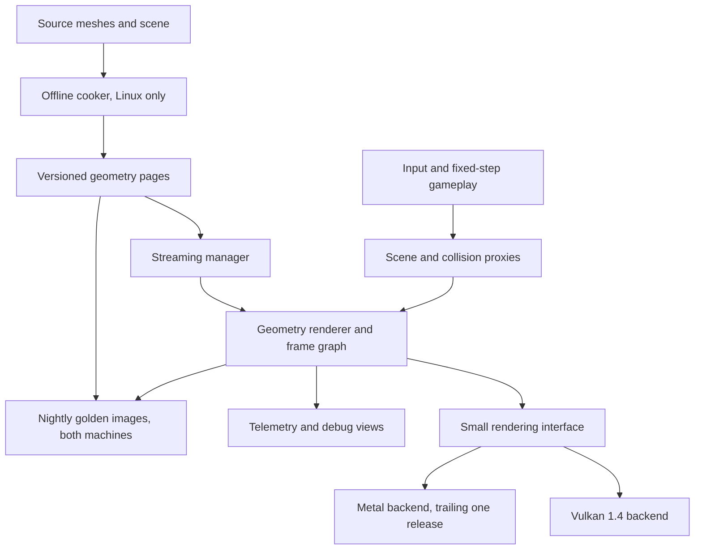
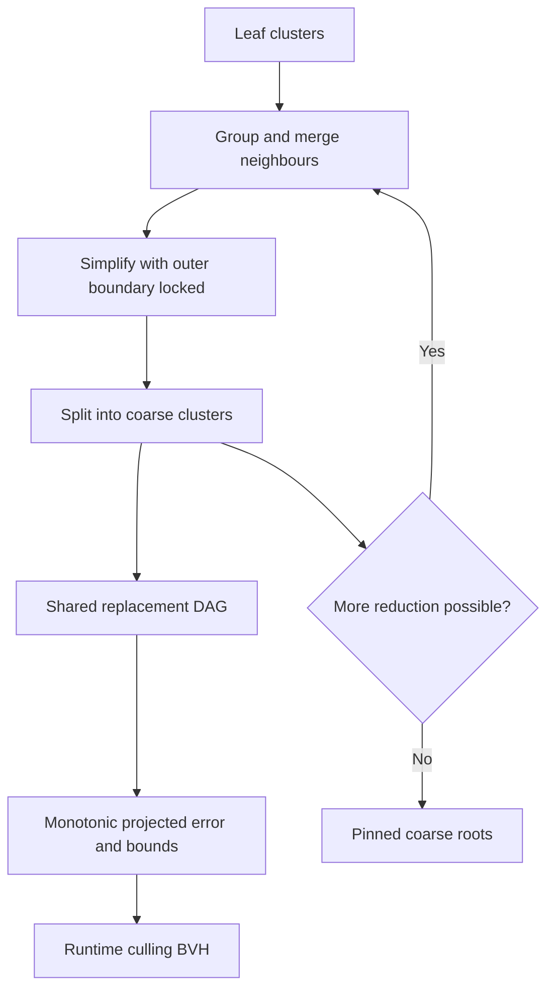
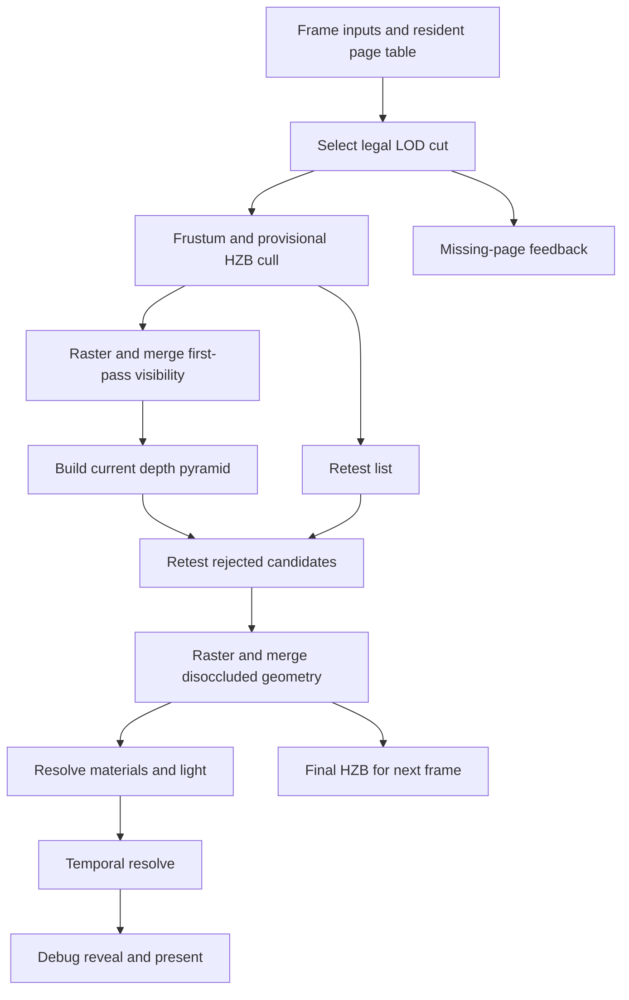
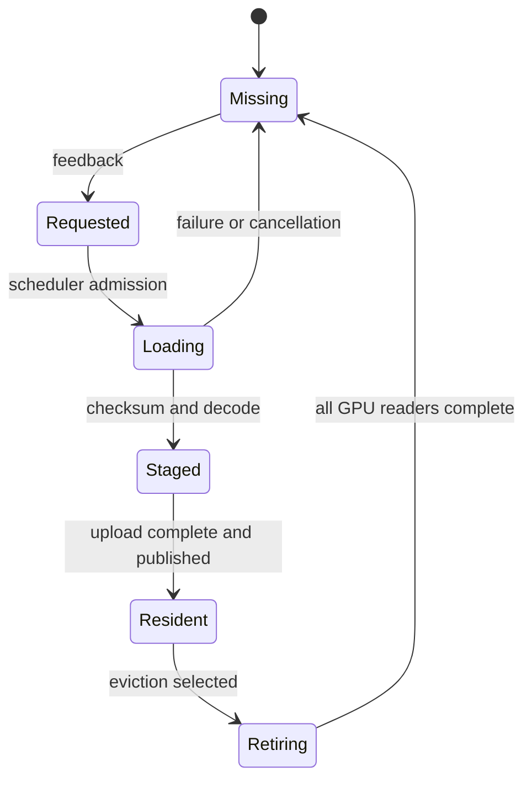

# Architecture — virtualized geometry demo engine

Companion files: [Roadmap](roadmap.md) · [Benchmarks](benchmarks.md) · [Gates](gates.md) · [CI](ci.md) · [Math](math.typ) · [References](references.md).

This file is the single source of truth for the platform contract, memory budgets, data formats and module ownership. The other files reference it and do not restate its tables.

---

## 0. Decision record

| ID | Decision | Status |
| --- | --- | --- |
| **D0** | **Purpose: ship a playable, streamed geometry demo.** The cluster-DAG generator is integrated from `clusterlod.h`; everything downstream of it is written here | Taken |
| **D1** | **L60 required, L120 measured and reported without a budget table, no 240 Hz tier** | Taken |
| **D2** | **Backend interface co-developed from R1; Metal implementation trails Vulkan by one release** | Taken |
| **D3** | **Slang as the single shader source language**, targeting SPIR-V and MSL. Every kernel written once | Taken |
| **D3b** | **Mesh shaders are the primary raster path** from R2; indexed indirect draw retained permanently as oracle and fallback | Taken |
| **D4** | **Cooker budgets are regression gates**, with descending-size scheduling, an in-flight triangle cap and per-thread arenas | Taken |
| **D5** | **Cooking is Linux-only.** Cooked packages are build artifacts | Taken |
| **D6** | **The compute rasterizer is not a required capability.** Whether it is built at all is decided by the R2 triangle-area histogram | Deferred by design |
| **D6b** | **Visibility target topology.** Arises only if D6 says yes; shared 64-bit atomic target is the default, separate-attachment merge the fallback | Deferred by design |
| **D7** | **Every sizing number derives from what a capability claim requires as proof.** 1 GiB normal pool; Zorah as the committed corpus at two densities — 9.5 GiB demo at 9:1, 48.6 GiB full scene at 48:1 | Taken |
| **D8** | **Geometry from the Zorah export; materials from a separate UV- and tangent-equipped fixture.** A procedural generator is optional work, priced separately | Taken |

**Deferred by design is not undecided.** D6 and D6b have one decision point (the R2 histogram), one default (do not build it; publish the measurement) and nothing downstream blocking on them — the engine is correct and complete with a single hardware raster path. They are reopened at R2 and nowhere else.

### D0 — what this project is for

Ship a playable, streamed geometry demo. The build-side cluster DAG is the one part of this system that is solved, MIT-licensed and actively maintained, so it is integrated rather than re-derived.

What remains engine work: the page format, the error-bound and dependency representation, the cut validator, the runtime BVH, residency, page publication, GPU lifetimes and the reveal. That is also where the original writing is.

`clusterlod.h` earns its keep twice over. Beyond generating the DAG it is a **differential oracle**: when the cut validator disagrees with its group output on a fixture, one of the two is wrong and you know where to look. Budget for using it that way.

---

## 1. Objective and delivery contract

Build a C++23 engine with native Vulkan 1.4 on Linux/NVIDIA and native Metal 4 on Apple Silicon. Ship a playable environment in which the player moves from a distant vista to close-up geometric detail, then reveals the actual triangles, clusters, LOD selection and streamed pages producing the image.

The reference capability family is Nanite as described in the 2021 SIGGRAPH deep dive: hierarchical cluster geometry, automatic detail selection, compression, fine-grained streaming and geometry visualization. The structures and algorithms here are our implementation. [S21 PDF](https://advances.realtimerendering.com/s2021/Karis_Nanite_SIGGRAPH_Advances_2021_final.pdf), [UE 5.2 Nanite docs](https://dev.epicgames.com/documentation/en-us/unreal-engine/nanite-virtualized-geometry-in-unreal-engine?application_version=5.2).

### Delivery contract

| Capability | Required at R4 | Notes |
| --- | --- | --- |
| Dense static meshes and rigid instances | Yes | |
| Automatic cluster LOD, seam-safe transitions | Yes | Generation integrated; bounds, cut validity and packing are ours |
| GPU selection, frustum and occlusion culling, indirect execution | Yes | |
| Geometry larger than the resident GPU pool | Yes — **9:1 on the demo corpus, 48:1 on the full-scene stress** | §7 |
| Hardware rasterization of clusters | Yes | Mesh shaders primary; indexed indirect draw is the oracle |
| Compute rasterization of small triangles | **No — measured experiment** | Gated on the R2 histogram, D6 |
| Opaque PBR, normal maps, multiple material sections | Yes, on the **material corpus** — the geometry corpus has no UVs or tangents (D8) | |
| Temporal antialiasing | **Yes** | Sub-pixel LOD transitions are not viewable without it |
| Masked foliage and bounded wind deformation | One constrained family | |
| Walkable demo, collision, live mesh reveal | Yes | First delivered at R1 |
| Shadows | Directional cascades and IBL | Cascade error metric in §5 |
| Lumen, Substrate, PCG, editor equivalence | Out of contract | |

R4 proves a specified Nanite-like geometry capability set on two named machines. It does not establish Nanite parity. Keep a feature ledger linking every claimed feature to a passing benchmark.

---

## 2. Platform contract

### Machine manifest

Recorded at every benchmark run.

| Field | Profile L | Profile A |
| --- | --- | --- |
| GPU / SoC | NVIDIA RTX 4060 Laptop GPU | Apple M3 Pro |
| VRAM / unified | 8 GB per vendor spec; record device-reported value | 18 GB unified |
| CPU | Intel Core Ultra 9 185H | M3 Pro CPU complex |
| System RAM | 32 GB | shared with GPU |
| OS / API | Linux x86-64, Vulkan 1.4 | macOS, Metal 4 |
| Render target | 1920×1080 native, no reconstruction | 1920×1080 native, no reconstruction |
| Required frame rate | 60 FPS | 30 FPS |
| Recorded per run | GPU core count, driver and SDK versions, Slang version, power limit, AC state, cooling mode, sustained clocks, temperatures, SSD model and measured read rate, mux and compositor path, shader hashes | as left, plus memory pressure, compression and swap deltas |

"Native 1080p" names the render buffer, not the Mac's physical panel; record presentation scaling separately. Laptop results are valid for the recorded power and display configuration only. [NVIDIA spec](https://www.nvidia.com/en-us/geforce/laptops/40-series/), [Apple spec](https://support.apple.com/en-us/117736).

### D1 — frame-rate policy

**L60 required. A30 required. L120 measured and reported with no budget table and no pass/fail status.**

L120 appears in the release report as a number. It never blocks a release and no optimization work is scheduled to reach it. If L60 lands with large headroom, reopen this as a new decision rather than letting L120 quietly become a target.

There is no 240 Hz tier. A 1.25 ms CPU active frame is not a target anyone can design toward before knowing their actual CPU cost, and a display refresh rate is not an engineering requirement.

Frame intervals: 60 Hz = 16.667 ms, 120 Hz = 8.333 ms, 30 Hz = 33.333 ms.

### D2 — the Metal backend trails by one release

The backend interface is co-developed against a real second implementation from R1. The Metal implementation trails one release behind Vulkan: it implements R1's feature set during R2, R2's during R3, and catches up fully during R4's qualification work. **Profile A is a qualification profile from R2 onward, on the previous release's feature set.**

The reasoning. A native Metal backend duplicates resource binding, submission, synchronization, timing and the host side of every compute and raster path — 25–30% of total engineering effort. Building it at head means re-porting every design that churns before it settles, and between R0 and R3 the page format, binding model, visibility key layout, dispatch structure and raster path all churn. Building it at the end means porting into an abstraction that only Vulkan ever exercised, losing the cross-backend oracle for eighty weeks, discovering Apple-specific structural surprises late, and holding a single large block of work that is easy to defer twice.

Trailing by one release takes neither. The abstraction stays honest because something other than Vulkan exercises it from the start; the differential oracle survives; nothing gets ported until it has stopped moving; the work never accumulates into a lump. Cost ≈ 500 team-hours spread across R1–R4, inside the roadmap total.

This depends on D3. With shaders single-source, the duplication is host-side only. If Slang were abandoned, this estimate moves toward 800 hours.

**Operating rules**, without which "trailing" degrades into "deferred":

- **One release, not two.** If Metal is more than one release behind at a boundary, that is a schedule event: Vulkan pauses or the descope ladder is used.
- **A subsystem is not done on Vulkan until its interface is agreed.** Metal need not be written, but the binding model, resource lifetimes and dispatch shape are reviewed by whoever will write it.
- **Profile A gates from R2**, on the previous release's features. Every gate result records which feature set A was running.
- **The CI report shows the Metal lag every day** ([ci.md §6](ci.md)). A gap nobody displays is a gap that grows.
- **MoltenVK stays installed as a smoke-test path.** It catches gross portability mistakes on the Mac before the native path exists for a given subsystem. It is not a shipping path: on Apple Silicon it reports `shaderBufferInt64Atomics = false`, so it could not run a 64-bit depth/ID compute rasterizer if D6 ever adopted one. [Slang target notes](https://github.com/shader-slang/slang/blob/master/docs/target-compatibility.md)

Dropping the Mac to a follow-on program is item 5 on the descope ladder in §9, worth roughly 700 hours including contingency.

### D3 — shader toolchain

**[Slang](https://github.com/shader-slang/slang) is the single shader source language**, targeting SPIR-V for Vulkan and MSL for Metal. Every kernel is written once. It ships in the Vulkan SDK, its capability system rejects unsupported feature use at type-check time rather than at runtime on one device, and its MSL output preserves identifiers, which matters when debugging the same kernel on two GPUs.

Three things to set up rather than discover:

- **Per-target capability profiles, enforced in CI.** Declare the required capability set explicitly per kernel and let the compiler enforce it. This is what stops a kernel compiling on Vulkan and failing on Metal eighty weeks later, and it runs on every push.
- **64-bit atomics are a versioned claim, not a permanent property.** Slang's target notes report no 64-bit atomic fetch-add on the MSL path; Apple's feature tables report full 64-bit atomic operations from Apple9, with an Apple8 macOS min/max exception. Those describe different layers and both can hold. The compute rasterizer, if D6 adopts one, needs atomic *max*, not add. Verify the exact operation in a compiled kernel at R0 and record GPU family, SDK, MSL version, address space and shader stage — the vendor table alone is not the check.
- **One documented escape hatch.** If Slang's Metal output for a specific kernel is unsatisfactory, that kernel may drop to hand-written MSL — recorded as an exception with a reason, with the Vulkan side staying in Slang. The failure mode to avoid is a slow drift back into two hand-written shader sets, one exception at a time.

Shader hashes and the Slang version are recorded per run. A compiler change is a valid explanation for a timing change and never for a correctness change.

### D3b — mesh shaders are the primary raster path

A cluster is a meshlet. Mesh shaders are the target from **R2**, when clusters first carry LOD; R1 uses indexed indirect draws because there is no cluster selection yet and the simpler path reaches something walkable faster.

**The indexed-draw path is kept permanently**, not deleted once mesh shaders work. It is the correctness oracle for every cross-backend and hybrid-raster comparison, and the fallback for any device or driver that cannot run the mesh path. Budget for maintaining it: a second raster path that silently rots is worse than no oracle, because it will be trusted.

Measure at R0 rather than assume: mesh-shader cluster dispatch throughput on each device, and the cost of `doubleSided` materials on the mesh path — published results report double-sided materials being significantly slower under `EXT_mesh_shader` than under vendor extensions, and the foliage material in §6 is exactly that case.

### Backend feature matrix

| Concern | Vulkan backend | Metal backend | Decision |
| --- | --- | --- | --- |
| Runtime | Vulkan 1.4 loader and device, explicit feature chain | Native Metal; C++23 core plus thin Obj-C++ bridge; trails Vulkan by one release | Fail clearly if qualification features are absent |
| Cluster raster | `VK_EXT_mesh_shader` primary, indexed indirect draw as fallback and oracle | Mesh pipelines where the GPU family supports them | D3b |
| GPU work | Compute pipelines, indirect dispatch | Compute pipelines, indirect commands | Same dependency graph both sides |
| Resource binding | Descriptor arrays, explicit limits, checked indexing | Argument buffers | Shared logical resource IDs |
| Visibility atomics | `shaderBufferInt64Atomics` | Exact `ulong` atomic max verified in a compiled kernel | Only relevant if D6 adopts a compute path |
| Synchronization | Synchronization2, timeline semaphores | Explicit hazards and completion tracking | |
| Geometry memory | Suballocated device-local buffers, staging rings | Private buffers, shared staging | Explicit software page table both sides |
| Timing | Timestamp queries, valid-bit and period handling | GPU counters plus command-buffer duration | Unsupported counters reported as unavailable, never as zero |

[Vulkan 1.4](https://docs.vulkan.org/features/latest/features/proposals/VK_VERSION_1_4.html), [mesh shader extension](https://docs.vulkan.org/refpages/latest/refpages/source/VK_EXT_mesh_shader.html), [64-bit atomic features](https://docs.vulkan.org/refpages/latest/refpages/source/VkPhysicalDeviceShaderAtomicInt64Features.html), [Metal feature tables](https://developer.apple.com/metal/Metal-Feature-Set-Tables.pdf).

---

## 3. Modules, ownership and dependencies

One repository, one scene and asset schema, one shader source language, two backends. C++23 for host code. Serialized fields use explicit integer widths and a declared byte order.

| Module | Responsibility | Owner |
| --- | --- | --- |
| `core/`, `platform/` | Jobs, files, errors, logging, clocks, window and input | B, reviewed by A |
| `rhi/`, `backends/` | Resources, pipelines, submission, capability queries | A owns Vulkan; B owns Metal |
| `tools/cooker/`, `geometry/format/` | Import, DAG build, packing, verification | B |
| `tools/assets/` | Corpus acquisition, licence audit, instancing layout, scene assembly, manifest | B |
| `renderer/geometry/` | Traversal, culling, rasterization, visibility resolve | A |
| `streaming/` | Requests, I/O, decompression, publication, eviction | B |
| `renderer/materials/`, `renderer/lighting/` | Material resolve, shadows, TAA, post | A |
| `game/`, `tools/inspect/`, `bench/` | Playable shell, reveal UI, reproducible runs | B; both approve gates |
| `ci/` | Golden-image regression on both machines ([ci.md](ci.md)) | B |
| `tools/gen/` | Procedural content generator — **optional** (D8) | B, if undertaken |

### Third-party dependencies

| Dependency | Licence | Use |
| --- | --- | --- |
| [meshoptimizer](https://github.com/zeux/meshoptimizer) ≥ 1.0 | MIT | Clusterization (`meshopt_buildMeshlets`, `meshopt_buildMeshletsSpatial`), simplification with per-vertex locks (`meshopt_simplifyWithAttributes` with `vertex_lock`, `meshopt_SimplifySparse`, `meshopt_SimplifyErrorAbsolute`), `meshopt_optimizeMeshlet`, `meshopt_partitionClusters`, vertex and index codecs, `meshopt_spatialSortTriangles` |
| [`clusterlod.h`](https://github.com/zeux/meshoptimizer/blob/master/demo/clusterlod.h) | MIT, single header | Cluster-group DAG build. Configure, feed a mesh, receive groups of clusters via callback |
| [Slang](https://github.com/shader-slang/slang) | MIT | Shader source to SPIR-V and MSL |
| Physics library | — | Character controller and collision proxies |
| Window and input, image codecs, CMake | — | |

Versions and commits are pinned and recorded in every manifest. `clusterlod.h`'s API is explicitly evolving upstream, so a version bump is treated as a content format change requiring a re-cook and a named new baseline.

**Reference implementation to measure against:** [`vk_lod_clusters`](https://github.com/nvpro-samples/vk_lod_clusters) (Apache-2.0) is an end-to-end Vulkan cluster-LOD renderer with streaming, built on `clusterlod.h`. It is a correctness oracle, a performance reference on the same hardware, and the source of the test corpora in §8.

---

## 4. Offline geometry pipeline

### Import and sanitize

Accept glTF 2.0 for scenes and a triangle-mesh path for dense individual assets. Canonicalize units, winding, handedness and material sections. Report invalid indices, nonfinite values, zero-area faces, disconnected components and nonmanifold edges. Retain UV, colour and normal seams. Reject unsupported inputs with an actionable error rather than silently corrupting topology.

**Reindex before anything else.** Published glTF exports routinely carry catastrophically redundant indexing — 90 M vertices for 30 M triangles is a real figure from a shipped asset. Poor indexing degrades simplification quality and makes clusterization slow.

### Cluster and DAG construction

Target ~128 triangles per cluster with a bounded local vertex count. Split clusters at attribute discontinuities and vertex limits. Partition by material to start, so raster bins stay simple.

The construction is the standard regrouping loop: build leaf clusters, group neighbours, merge, simplify with the group's current external boundary locked, split back into bounded clusters, then **regroup at the next level so yesterday's boundaries become interiors**. This is what prevents a locked-boundary tree accumulating dense un-simplifiable edges. The result is a DAG, not a tree. [S21 pp. 31–33, 45–48](#reference)

`clusterlod.h` performs this loop. What remains engine work, and what the gate actually tests:

1. **Dependency and error representation.** Store group-consistent error and projection bounds. Enforce monotonic **projected** error along every DAG dependency path, not merely monotonic scalar object-space error. Validate under quantization and nonuniform transforms.
2. **Cut validity.** A valid selected cut covers the surface exactly once. Parent coverage is suppressed only when the entire compatible finer replacement group is active. Shared DAG nodes must not be emitted twice. A single missing page can prevent an entire replacement group from activating; a per-cluster residency test is insufficient. [S21 pp. 63–66, 122–126](#reference)
3. **Page packing and the format.**
4. **Runtime BVH.** A **separate BVH over group and cluster candidates**. The DAG expresses replacement dependencies; the BVH accelerates conservative selection and culling. Start with bounded level-wise dispatches; a persistent work queue is an optimization only after forward-progress and termination tests pass on both GPUs. [S21 pp. 69–74](#reference)

The local selection predicate is `parent_projected_error > threshold && cluster_projected_error <= threshold`, with root and finest-resident cases handled explicitly. Every group member uses identical decision inputs. Hysteresis, if introduced, applies to coherent group state — never to independent per-cluster thresholds, which produce inconsistent cuts.

### D4 — cooker budgets

Published measurements on comparable hardware anchor these:

| Reference measurement | Source |
| --- | --- |
| 7.9 M triangles, full cluster-LOD processing: **~10 seconds** on a Ryzen 9 7950X | `vk_lod_clusters`, threedscans_animals |
| 1.63 G triangles with compression and cache serialisation: **6–10 min**, 29 GB RAM at 16 threads | `vk_lod_clusters`, Zorah |
| 1.64 G triangles, DAG build without serialisation: **~2m 35s**, 16 threads | [Billions of triangles in minutes](https://zeux.io/2025/09/30/billions-of-triangles-in-minutes/) |

Allowing for the 185H being slower than a 7950X and for our own quantization and packing on top: **≤ 2 minutes for a 10 M-triangle clean cook**, which is the regression gate. Corpus cooks are capacity plans, not gates: **≤ 20 minutes for the 320 M demo corpus, ≤ 90 minutes for the full 1.63 G scene**, both at **8 threads or fewer** so peak RSS stays inside 32 GB. The thread count is recorded in the cooker manifest, because a cook that used sixteen threads and swapped is not the same measurement. The 10 M gate is not an aspiration — a cook that suddenly takes four minutes instead of two has a cause, and a correctly sized budget is one that fires.

Three implementation requirements:

- **Sort meshes by triangle count descending** before dispatching to the thread pool. Otherwise the tail of one 30 M-triangle mesh dominates wall time while the other threads idle.
- **Admit work against a total memory limit, not a thread count.** Eight threads do not bound the memory of one large imported mesh, its decompressed source buffers, accumulated outputs or simultaneous simplification scratch. Record two separate quantities in the cooker manifest — **a total memory admission limit** and **the largest per-task footprint** — and derive the thread count from the first. Checkpoint each geometry on completion so an interrupted cook resumes rather than restarting.
- **Use per-thread allocation arenas** for clusterization and simplification working buffers. Global allocator contention is a documented and significant cost in this workload.

### D5 — cooking is Linux-only

**Cook on Linux. Cooked packages are build artifacts.** The Mac loads them; it does not produce them.

Quadric-error simplification and spatial partitioning are floating-point-sensitive. x86-64 and AArch64 will not agree bit-for-bit, and chasing that has no payoff.

What this requires:

- **A content cache keyed by input hash, cooker version, settings and asset manifest hash.** Both machines read; only Linux writes. Package hashes are reproducible on the same toolchain, and a toolchain change produces a named new baseline.
- **Packages are portable and endian-explicit**, so an x86-64-produced package loads correctly on Apple Silicon.
- **The Mac still runs the decode path nightly.** Not cooking is not the same as not verifying.

The Linux machine would otherwise be a single point of failure for content. Two things remove that: an off-machine backup of the cache and source assets, and a **pinned container image that runs the cooker on a hosted Linux runner** ([ci.md §9](ci.md)), so fixtures are produced and archived nightly independent of the laptop. The container pins the toolchain and ISA baseline, and its output hashes are compared against the laptop's — a divergence falsifies the determinism claim behind every package hash.

### Encoding and package contract

Use a shared object-coordinate quantization grid so duplicated seam vertices decode identically. Quantization error is part of the LOD error envelope. Version the disk codec and GPU layout independently. Start by CPU-decompressing disk blocks into GPU-decodable cluster payloads; compute-shader decompression after upload is a later optimization.

**The page size is frozen at the end of R1**, chosen from the R0 decode and I/O sweep across 64/128/256 KiB. Both benchmarks exist long before the streaming manager does, and the published article describing the format should describe something stable. A later change invalidates package hashes and requires a named new baseline.

| Record | Required fields and invariants |
| --- | --- |
| Asset | Content hash, format version, bounds, roots, material table, source statistics |
| Replacement group | Coarse and fine shared references, dependency closure, boundary compatibility, group-consistent error and bounds |
| Culling BVH node | Conservative spatial and error bounds, child ranges, bounded group-candidate references |
| Cluster | Vertex and triangle counts, material bin, decoded offsets, bounds, optional normal cone |
| Page | Page ID, file range, checksum, decoded size, codec version, cluster directory, dependency closure |
| Instance | Asset ID, current and previous transform, transform scale bound, flags |
| Physical slot | Virtual page ID, generation, GPU completion token, last-use epoch |

Clusters do not straddle pages; replacement groups may span several. Compression is per page so reads stay bounded. Reject corrupt or oversized blocks before GPU publication.

Keep roots and a compact top-level directory resident. Page lower BVH and DAG metadata alongside geometry when the full metadata set would exceed the profile cap; resident parents must carry enough request and fallback information to stop safely at a missing subtree. Charge metadata against the geometry budget. Build the collision proxy separately — **physics never depends on render-page residency**.

---

## 5. Runtime geometry selection

Right-handed world, normalized depth in [0,1], reversed Z: near is 1, far and clear are 0. Match viewport orientation and winding explicitly between backends.

Initial perspective error estimate:

`projected_error_px ≈ error_object × transform_scale_bound × viewport_height / (2 × tan(vertical_fov / 2) × z_nearest)`

Use the conservative nearest depth of the bound, not distance to its centre. `transform_scale_bound` is the largest singular value of the linear transform or a provable upper bound, not a single scale component. Near-plane crossings force refinement or a conservative projection. Orthographic views use a separate pixel-to-world conversion.

#### The error contract: estimated, and named as such

The production path uses **measured error plus a recorded margin**. That is an *estimate*, not a bound, and these documents say so rather than borrowing the language of a guarantee.

| Mode | What it claims | Where it applies |
| --- | --- | --- |
| **Certified** | A conservative bound, including quantization and transform effects, conservatively projected | Small adversarial fixtures only |
| **Estimated** | A nominal 1 px selection target, with the estimator and margin recorded, and measured image and geometric error on a frozen corpus | Production assets |

In estimated mode, **no universal pixel bound is claimed.** A camera sweep can expose errors; it cannot prove every camera correct. The asset manifest records which mode produced each asset's bounds.

Three properties are separate and are recorded separately: the **monotonicity** of the stored bound, the **conservatism** of that bound, and its **behaviour after projection**. Passing small fixtures establishes the first two, on those fixtures only.

The differential comparison against `clusterlod.h` checks *integration agreement*, not independent geometric correctness — and upstream describes its own simplification target error as approximate. An **independent geometric validator is a separate obligation**, and it is a separate gate row.

Default error target 1.0 px with a hysteresis band. **Hysteresis must either fit inside the nominal target or disclose its allowed excess.** A resident cut obeys the bound unless a documented budget or residency fallback is active; count those exceptions in the HUD, **classified by reason**. A fully resident quality fixture must not pass because every bad pixel was labelled fallback: separate unavoidable finest-level error from avoidable selection or capacity failure. Select and compact clusters on the GPU. Bound every work queue; on overflow preserve complete parent coverage and report it, never silently dropping clusters. Ship gates require zero overflow in normal runs.

### Shadow-view LOD

Each cascade selects against its own projected error in **shadow-map texels**, with a looser target than the camera view — start at 2 texels and tune. Cascades share residency with the camera view where the cut allows, and issue requests under a **lower-priority class that cannot evict the camera's fallback closure**. A cascade that cannot meet its target falls back coarser rather than stalling, and the degradation is reported.

Without this, shadow views silently double residency demand and the first symptom is unexplained thrashing.

### Occlusion and disocclusion

Build a hierarchical depth pyramid using **minimum reduction, because depth is reversed**. A cluster is occluded only if its nearest possible depth is behind the conservative farthest occluder across its entire projected footprint, with numerical bias allowed. Uncovered pixels retain depth 0, which prevents false occlusion through holes.

Two-pass, as in [S21 p. 75](#reference): test current candidates against the previous-frame HZB using **previous transforms for provisional rejection only**, and current transforms for recovery. Newly created or invalid-history instances are treated as visible. Render first-pass candidates, build the current-frame HZB, retest rejected candidates, render newly visible geometry in a second pass, then build the final HZB. Disable historical occlusion after a camera cut. Conservatively accept near-plane crossings and uncertain bounds. Deformed geometry uses expanded bounds.

This recovers visibility in the same frame. Simpler single-pass bbox-versus-last-frame-HiZ schemes are cheaper and produce documented artifacts under fast motion; that is the failure mode this design spends complexity to avoid, and the benchmark demonstrates the difference.

---

## 6. Rasterization and shading

### D6 — the compute rasterizer is an experiment, decided at R2

**Deferred by design. Default: do not build it.**

A compute rasterizer exists to avoid two hardware properties that become pathological with very small triangles: quad overshading, where a one-pixel triangle still launches a 2×2 fragment block and wastes 75% of the work; and a fixed triangle setup rate, which makes millions of tiny triangles setup-bound while shading throughput idles.

The premise does not transfer automatically. **A 1-pixel error target does not produce 1-pixel triangles.** The error metric measures surface deviation, not triangle size, and the selector picks the coarsest cut meeting the bound — so on well-behaved surfaces it deliberately produces large triangles and never refines past the point where the bound is met. Published work on this exact technique reports a compute rasterizer being no faster than mesh shaders in typical cluster workloads, because clusters tend to carry larger-than-pixel triangles.

Sub-pixel triangles come from specific places: geometry the simplifier cannot reduce (foliage cards, thin fins, aggregate detail), cluster granularity, grazing angles, and budget fallback. A rock-and-ruin scene of closed surfaces is the favourable case for hardware raster; the foliage patch is not.

**So the decision is a measurement.** At R2, histogram projected triangle area on real content at the real error target, weighted by covered pixels and depth complexity. The question is what fraction of *rasterisation work* sits below ~1 px², not what fraction of triangles do. Build the compute path only if that fraction is material; otherwise publish the measurement.

Saying no also removes fixture S6, the B4-M gate, the atomic microbenchmarks, the MSL `ulong` atomic-max risk and the path classifier. The measurement is cheap and decides a large subtree.

### D6b — visibility target topology, if D6 says yes

With one raster path, visibility is an ordinary render target with ordinary depth testing and none of this applies. With two paths producing visibility, they must agree on one answer per pixel.

**The 64-bit key.** Pack depth into the high 32 bits and a primitive token into the low 32. Because depth is reversed-Z, in [0,1], finite and non-negative, IEEE-754 bit patterns compare in the same order as the floats. An **integer atomic max on the packed value performs the depth test**: nearest wins, atomically, with the token riding along with its own depth so the two can never be torn apart. Key zero is background. Equal depth uses a deterministic token tie-break. Generated and clipped triangles must map back to source triangle identity; check token capacity and abort on overflow.

**Never approximate this with two independent 32-bit atomics.** Two threads interleave such that the surviving depth came from one triangle and the stored ID from another, producing pixels that shade the wrong surface at a rate depending on GPU occupancy.

**Default: shared atomic target.** Both paths write the same 64-bit buffer. It is simpler, matches the reference design, and needs no extra pass. The alternative — hardware writing ordinary attachments, compute writing its own buffer, and a full-screen merge reconciling them — costs roughly 40 MB of read-modify-write traffic per raster pass at 1080p, doubled by the two-pass occlusion scheme, plus a depth-format round-trip and a tie-break rule that are both places to be subtly wrong.

The shared target is not free either: writing visibility from the fragment shader via atomics gives up some early-Z and hierarchical-Z rejection on the hardware path. That is the real tradeoff, and it is why this is measured rather than decreed. Both target GPUs support fragment-stage 64-bit atomics, so portability is not the deciding factor here.

### Hybrid classification, if built

Classify by projected bounds and triangle size, calibrated per GPU. Tiny opaque triangles to compute; large, near-plane-crossing, masked and deformed geometry to hardware. Identical clipping convention, sample position, top-left coverage rule, depth mapping and primitive identity on both paths.

### Material resolve

Read visible identity, decode triangle attributes, reconstruct perspective-correct barycentrics, shade only visible surfaces. Start with a fullscreen resolve; add material tile and bin compaction once shader divergence is demonstrated rather than assumed. Compute UV gradients analytically from the projected triangle and use explicit texture gradients — neighbouring pixels may belong to unrelated triangles. Handle degenerate screen projections robustly.

Use bounded texture sets and ordinary mip streaming first. **Geometry virtualization does not solve texture residency**; track textures separately and expect them to be the second memory problem.

Lighting: metallic-roughness PBR, IBL, one directional light, cascaded shadows, SSAO, exposure and tone mapping. **TAA is required.** A renderer whose LOD transitions happen at the 1-pixel level is not viewable without temporal integration, and the reference design assumes the switch is hidden by a temporal filter. Benchmark geometric error with jitter and TAA disabled; inspect final output with them enabled; measure temporal stability explicitly.

For the constrained foliage material: evaluate opacity **before** committing visibility and depth, apply identical deformation in visibility, shadows and resolve, expand bounds by the declared displacement envelope, generate motion vectors from previous deformation state, and disable normal-cone culling on two-sided or deformed geometry. Masked rasterization stays on hardware.

---

## 7. Memory and sizing

### D7 — every number derives from a claim it exists to prove

| Claim | What would prove it | What the proof requires | Resulting number |
| --- | --- | --- | --- |
| Renders geometry beyond the resident pool | A route where cumulative decoded bytes exceed the pool several times over, with observed eviction and reload, and no holes at any point | Dataset several times the pool; multiple disjoint working sets; a route forced through all of them | **1 GiB pool, 9.5 GiB demo corpus at 9:1**, plus a 48:1 full-scene measurement |
| Detail is selected, not authored | Selected triangles far below leaf triangles at a fixed error target, with the silhouette still inside tolerance | Source assets carrying far more detail than 1080p can resolve | **≥ 100 M unique source triangles** |
| Scale is not faked by repetition | Unique and instanced counts reported as separate quantities | Real instancing, and two independent counters | **≥ 1 G source-equivalent instanced** |
| Runtime cost tracks the screen, not the source | Source density rising 4× while selected triangles and geometry GPU time stay roughly flat | Same surfaces cooked at 1×/2×/4× tessellation, camera and error fixed, residency unconstrained | **A reference curve, expected below ~25% growth from 1× to 4×.** `diagnostic`, not a pass condition — see gate B4.16 |
| Streaming degrades gracefully rather than failing | Fallback surface visible and measured under throttled I/O, with bounded time-to-quality | Injected bandwidth and latency limits; working sets sized to the stress pool | **256 MiB/s + 10 ms; 4 working sets ≈ 400 MiB each** |
| It works on both machines | Identical content, settings and error target on L and A, results reported separately | Equal geometry pool and texture capacity across profiles | **Same 1 GiB pool, same 2 GiB textures both sides** |

If a proposed target does not fit a row, ask which claim it serves. If there is no claim, drop it.

### What bounds runtime work, regardless of source size

At 1920×1080 there are **2,073,600 pixels**, and that is the only universal quantity here. A 1 px *error* target does not imply a triangle count: a flat rectangle meets it with two triangles, and layered thin geometry can need millions. Selected-triangle counts are **corpus-specific**, recorded against a frozen reference curve on a named fixture.

That number is the actual claim of virtualized geometry: it is a function of the screen, not of the source, and should barely move whether the source is 10 M triangles or a billion.

- **It is a live diagnostic against its own fixture's curve**, not against a universal band. Deviation from the frozen curve means the selector is refining past target, hysteresis is oscillating, or cluster bounds are wrong. It goes on the HUD from R2.
- **It frames the D6 question.** A few million triangles over two million pixels puts the *mean* around a pixel, but the distribution decides the answer — which is what the histogram measures.

### Dataset size is derived, not targeted

At 100 M unique source triangles and 128 triangles per cluster: ~781 K leaf clusters. A DAG with ~2:1 reduction per level holds roughly **2× the leaf count in total nodes**, so ~1.56 M clusters and ~200 M cluster-triangles stored.

| Encoded bytes per source triangle | Leaf package | Full DAG on disk |
| --- | --- | --- |
| 32 B | 3.0 GiB | ~6.0 GiB |
| **16 B — the target** | 1.5 GiB | ~3.0 GiB |
| 12 B, achievable with quantization and meshopt codecs | 1.1 GiB | ~2.2 GiB |

Dataset size is a consequence of triangle count and encoding efficiency. State the bytes-per-triangle target, state the triangle count, derive the size, then set the pool from the oversubscription ratio the proof requires. A published reference scene renders from a ~2 GB pool against a 26 GB cache — roughly 13:1 — and is documented as un-preloadable. That is what a streaming test looks like.

### The oversubscription target: Zorah at two densities

An ≥ 8:1 ratio against a 1 GiB pool needs ≥ 8 GiB of cooked geometry, which at 16 B per source triangle with a twofold hierarchy means **≈ 268 M unique source triangles**. The only public corpus that large is Zorah at 1.63 G triangles, and **Zorah is the committed corpus.**

Cooking it whole does not fit the machine, so the corpus is used at two densities. Both are committed; they answer different questions.

| | **Demo corpus (S5, S8)** | **Full-scene stress (S9)** |
| --- | --- | --- |
| Unique source triangles | ≈ 320 M, a defined Zorah subset | 1.63 G, the whole scene |
| DAG clusters | 5.0 M | 25.5 M |
| Cooked geometry | **9.5 GiB** | **48.6 GiB** |
| Ratio against the 1 GiB pool | **9.5 : 1** | **48 : 1** |
| Ratio against the 512 MiB stress pool | 19 : 1 | 97 : 1 |
| Cluster metadata at 64 B/cluster | **305 MiB** — fits the 1 GiB pool, **not** the 512 or 256 MiB profiles | **1.52 GiB — exceeds every profile** |
| Cook, 8 threads on the 185H | ≈ 8 min | ≈ 40 min plus packing |
| Disk for source, upstream cache and our cooked output | ≈ 15 GiB | **≈ 120 GiB** — see the disk note below |

**The demo corpus carries every gate. The full scene is `conditional`** in the [gate registry](gates.md): we commit to attempting it, with free disk and bake memory as the named precondition, and it reports `UNAVAILABLE` otherwise. It does not block R3. That is the right status for a headline number — a 48:1 ratio on a published, externally reproducible scene is a far better result than 8:1 on content nobody else can obtain, and it is still not worth holding a release hostage to a laptop's free space.

#### What committing to this costs

Two consequences, both on the critical path now rather than contingent.

**Metadata paging becomes mandatory.** At 25.5 M clusters the cluster records alone are 1.52 GiB, larger than the entire geometry pool, so the full top-level directory cannot be resident. This was already anticipated — page lower DAG and BVH metadata alongside geometry when the full set exceeds the cap — but at 48:1 it stops being a fallback and becomes a required R3 feature, budgeted at 40 engineering hours.

**The contract is a pinned-byte cap, not a level count.** The figures below are an idealized binary forest with 32 roots at 64 B per node, `M(k, r) = 64 · r · (2^k − 1)`, and they scale linearly with root count:

| Prefix | 32 roots | 128 roots | 1,000 roots |
| --- | --- | --- | --- |
| Top 8 levels | 0.5 MB | 2.0 MB | 16 MB |
| Top 12 levels | 8.4 MB | 33.6 MB | 262 MB |
| Top 14 levels | 33.6 MB | 134 MB | 1.05 GB |

Nothing establishes that a multi-asset corpus is a 32-root binary forest, and replacement groups, cluster records and BVH nodes are distinct object types whose counts need not follow one geometric series. So:

- **Commit to a pinned-byte cap** — start at 32 MiB — and choose a measured hierarchy prefix or per-asset frontier that fits inside it.
- **Census the records**: actual count and size per record type, per asset, recorded in the asset manifest.
- Treat "twelve levels" as an experiment whose result goes in that census, never as the allocator contract.
- Exercise a missing-metadata traversal on a **small synthetic fixture** before the full-scene cook, so the failure mode is debugged at a scale where it can be read.

Everything below the frontier pages alongside its geometry, and the resident parent of any paged subtree carries enough request and fallback information to stop safely at a missing child.

**Disk becomes a real constraint, larger than first estimated.** The upstream geometry variant unpacks to ≈ 9.3 GB and its own render cache requires ≈ 62 GB beside it; our cooked output at 48.6 GiB is additional. That is roughly 120 GiB on a laptop SSD that also holds the content cache and the result bundles, and we do not need the upstream cache if we cook ourselves — but the figure has to be measured, not assumed. Check free space before R3 rather than during it, and treat the full-scene cook as an artifact worth backing up rather than regenerating.

#### Three quantities, always reported separately

| Quantity | Meaning |
| --- | --- |
| Disk package bytes | Compression, page headers and padding included |
| Decoded unique page bytes | What would actually occupy physical slots |
| Route demanded-byte union | Pages the replay actually needs, with reloads counted separately |

A compressed-archive-to-pool ratio is not decoded-residency oversubscription. Four 400 MiB working sets total 1.6 GiB, which is 1.56× a 1 GiB pool: enough to demonstrate eviction and genuine new demand, not enough by itself to exercise a 9:1 or 48:1 dataset. Report the corpus ratio and the route's demand as separate numbers, and never substitute one for the other.

### Render targets, itemised

At 1080p: 64-bit visibility ~17 MB, depth ~8 MB, HZB mips ~11 MB, scene colour RGBA16F ~17 MB, TAA history ~17 MB, motion vectors ~8 MB, post chain ~30 MB, four 2048² cascades ~67 MB. **Total ≈ 175 MB.** The budget below carries headroom over that, not four times it.

### Budgets

| Allocation class | L | A |
| --- | --- | --- |
| Geometry pool — normal profile | 1,024 MiB | 1,024 MiB |
| Geometry pool — stress profile | 512 MiB | 512 MiB |
| Geometry pool — comfort profile, diagnostic only | 2,048 MiB | 2,048 MiB |
| Textures and mip residency | 2,048 MiB | 2,048 MiB |
| Render targets and transient buffers | 384 MiB | 512 MiB |
| Upload, readback, allocator slack, other | 512 MiB | 640 MiB |
| **Total engine GPU allocation, normal profile** | **3,968 MiB** | **4,224 MiB** |
| Host runtime memory | RSS ≤ 8 GiB | — |
| **Apple total physical process footprint** | n/a | **≤ 8,192 MiB, inclusive of GPU allocations** |

- On A, the GPU allowance is **inside** the process footprint, not additional. Charge shared staging exactly once. Query working-set headroom and trim before OS pressure. Sustained swapping is not a streaming mechanism.
- Both profiles use the same normal pool and the same texture capacity, so cross-device comparisons need no caveat.
- The L total leaves real headroom on an 8 GB laptop card that also drives a compositor.
- These are caps, not allocations. Measure allocated and used bytes separately.

### Streaming

Software-managed page cache; hardware sparse resources are a later optimization. GPU feedback is deduplicated and read asynchronously, typically two frames behind. Prioritize screen error, projected coverage, camera motion prediction and dependency cost. Coalesce file reads, decompress on workers, upload into free slots. **No synchronous disk access, decompression or page wait on the render thread.**

Publish page-table entries only after upload completion, at a defined frame boundary. Use generation checks and per-frame immutable page-table snapshots. Keep physical slots alive until every command buffer using them finishes — **completion tokens, never CPU frame-count guesses.** Pin roots, fallback pages and the dependency closures required by active cuts. Activate split groups only when all parts and dependencies are resident. Before evicting a fine page, guarantee a complete coarser representation remains resident. [S21 pp. 122–127](#reference)

When requests exceed bandwidth, retain the valid coarse surface and expose degraded error and residency metrics. Corrupt pages leave the fallback visible and produce a recoverable error. A root that cannot load prevents its asset activating. Teleports invalidate temporal history, prioritize new-view roots, and are measured by time-to-requested-quality.

---

## 8. Content and the playable reveal

### D8 — content is assembled from published corpora

**Committed path:**

| Source | Provides | Used for |
| --- | --- | --- |
| Public scan corpora — threedscans statue and animal sets, distributed as free glTF alongside `vk_lod_clusters` | 7–8 M triangles per scene, clean closed surfaces, high genuine detail | Hero assets, S1/S2 fixtures, the close-up detail the reveal depends on |
| The **Zorah geometry export** (`zorah_main_public.v2`) | 1.63 G triangles, 18.9 G instanced, **positions and normals only**, MIT-licensed | **The committed geometry corpus.** A ≈320 M-triangle subset carries the demo and the streaming gates; the full scene is the 48:1 measurement |
| A small UV- and tangent-equipped fixture, separately sourced and audited | Tens of millions of triangles at most | **The material corpus.** S7 and everything in R4 that needs texture coordinates |
| Instanced repetition with distinct transforms | Instanced source-equivalent scale | The ≥ 1 G instanced target |

Read and archive every licence in the asset manifest before R1 closes. The published Zorah version has some vegetation removed to make sharing possible.

**The consequence, stated plainly.** The demo is a walk through someone else's scene. Every technical claim in D7 proves identically on borrowed content — better, in fact, because a reader with the same laptop can download Zorah and reproduce the result, which is impossible for content you generated. What it costs is the "original environment" goal entirely: this is a rendering demonstration, not a place you made. No benchmark gate is affected, and the headline number is stronger for it.

#### The corpus splits, because one variant cannot carry both claims

The geometry export carries positions and normals. Normal-mapped PBR needs tangents and texture coordinates, and upstream states plainly that tangent space must be provided with the glTF meshes — there is no automatic generation. **The committed geometry corpus cannot run R4's material path.**

Switching to the textured export is not available on this hardware:

| Property of `zorah_textured_public.v1` | Value | Against Profile L |
| --- | --- | --- |
| Download | 70 GB | — |
| Extracted | 31 GB mesh + 48 GB textures | — |
| Peak RAM to bake the LOD hierarchy | **up to 64 GB** | 32 GB system RAM |
| Render cache beside the glTF | 50 GB | — |
| Texture count | 4,357 | 2 GiB texture budget |
| Texture residency upstream | fully loaded at scene init, not streamed | texture streaming is out of contract |

Sixty-four GB of bake memory against thirty-two, and forty-eight GB of textures against a two GiB budget. Neither is a tuning problem.

**So the corpus splits and the documents say so.** Geometry from Zorah carries scale, streaming and the 48:1 number. A small, separately audited UV- and tangent-equipped fixture carries S7 and the material path. The demo's PBR therefore runs on different content from its oversubscription number, and every published result names which corpus produced it. That is a real limitation and it is cheaper than any alternative on this machine.

One upstream technique to adopt rather than rediscover: the reference bake **caps its worker thread count from available memory and checkpoints each geometry shard on completion**, so an interrupted bake resumes. Memory-aware admission plus checkpointing is the answer to the cooker-memory problem, not a thread cap.

**Defining the subset is engineering work, not a selection.** The ≈320 M-triangle demo corpus must be a *named, reproducible* subset: a committed list of mesh identifiers and instance transforms, hashed, not "whatever we imported that day". It also has to satisfy the demo's own requirements from the reveal section — close-up detail, an occluding passage, a distant vista, a walkable route. Budget this as part of R3's content assembly rather than assuming the scene comes pre-shaped.

**The optional generator.** `tools/gen/` produces parameterized rock, ruin and debris meshes at arbitrary density, seeded and deterministic. It gives unlimited unique geometry with no licence questions, reproducible content hashes, and a dataset-size dial that hits any oversubscription ratio exactly. It is good material in its own right. It is priced in the roadmap and can be picked up at any point, including mid-release; the plan does not depend on it.

**What must happen either way:** import, sanitation, reindexing, instancing layout, a frozen asset manifest with licences and hashes, and scene assembly. Borrowing removes the authoring cost, not the pipeline cost.

### The demo

First-person walking, mouse look, collision, jump, reset, and a deterministic replay route. A lightweight interaction opens an occluding door or activates a reveal pedestal. Movement continues while the reveal is active.

Reveal modes:
- Lit view → animated screen-space wipe → deterministic triangle colours.
- Cluster colours, LOD and error heatmap, page-residency colours.
- Optional barycentric triangle edges at close range; do not issue billions of line primitives.
- Freeze camera and LOD independently for inspection, clearly labelled as frozen.

All debug views read **the actual selected geometry and visibility identity**. A wireframe over a separately loaded low-poly mesh does not satisfy the objective. Report unique source triangles, instanced source-equivalent triangles, resident bytes, selected triangles, per-path counts, fallback error, requests and frame time as separate quantities.

### Acceptance for the reveal itself

- A first-time viewer, given no explanation, can say what the reveal is showing.
- The wipe reads as continuous motion, not a mode switch: no hitch above the frame budget during the transition.
- At least one camera position where the selected detail is demonstrably produced by the hierarchy rather than by authoring: no authored per-object LOD chain exists for that asset, selected-triangle count visibly changes as the camera approaches, page replacement is observable, and normal maps are off for the geometry reveal. Record the error target and memory caps in force. ("Unachievable with conventional LOD" is not a testable claim — conventional LOD can represent the same geometry given enough storage and authoring.)
- The page-residency view visibly changes as the player moves. If it looks static, the streaming test is not testing streaming.

### Scale targets

≈ 320 M unique source triangles in the demo corpus and 1.63 G in the full-scene stress; ≥ 1 G source-equivalent after instancing, which Zorah exceeds by roughly 18× at 18.9 G; 9.5 GiB cooked at 9:1 and 48.6 GiB at 48:1. Each traces to a claim in D7.

The unique-triangle figure is **measured at R1, not assumed**. A dozen distinct scan assets at 7–8 M each gets most of the way and the Zorah corpus covers the rest with margin. If assembly falls short, reduce the target and report the real number — a smaller honest figure still proves selection and streaming. Padding with near-duplicates does not, and fails the claim it was meant to support.

---

## 9. Risk register

| Risk | Evidence | Response |
| --- | --- | --- |
| DAG construction does not converge on hard topology | Adversarial seam corpus, reduction curves | Fallback ladder below |
| **Certified error bounds cost more than the demo needs** | Cooker wall time with and without certified validation, measured at R0 | Certified checks — covering-radius and Lipschitz constructions — run on small adversarial fixtures only. The production path uses measured bounds with a recorded margin, promoted to certification only if those fixtures show the margin is unsafe |
| Upstream `clusterlod.h` changes under us | Pinned version and commit; diff on every bump | Treat a bump as a content format change: re-cook, named new baseline |
| Slang output regresses on one backend | Shader hashes and CI golden images per compiler version | Pin the version; a bump is a named baseline; one documented per-kernel escape to hand-written MSL |
| Metal falls further than one release behind | Metal hours tracked separately; CI lag indicator; checked at every release boundary | Schedule event, not absorbed quietly. Fallback is descope item 5 |
| Assembled corpus falls short of 100 M unique triangles | Unique count measured at R1 | Reduce the target and report the real figure; never pad with near-duplicates |
| Borrowed-asset licence narrower than assumed | Licence text read and archived before R1 ends | Drop the asset. On the critical path, because borrowing is the committed strategy — and now single-sourced, since Zorah carries the corpus |
| **Full-scene cook exceeds 32 GB or the SSD** | Peak RSS and free disk measured on a 320 M subset cook first | Cap threads at 8 and fall back to 4; if disk is short, ship the 9.5 GiB demo corpus and report the full-scene ratio as unavailable rather than estimated |
| **Metadata paging does not land in R3** | Measured resident byte sets against each profile, at R3 | Without it the demo corpus gates at 9:1 on the **1 GiB profile only**; the 512 and 256 MiB profiles are infeasible, because 305 MiB of records leaves 207 MiB and −49 MiB respectively. Metadata paging is therefore required for the demo corpus too, not only for S9 |
| Cracks or poor reduction | Seam corpus and error reports | Refine group boundaries, or accept a denser cut by holding the error target while the simplifier reduces less; never ship holes |
| Streaming thrash or use-after-free | Tiny-pool, latency and eviction tests | Repair publication and pinning before growing the scene |
| Foliage defeats geometric savings | Masked coverage and overdraw results | Constrain density and material family |
| Two-hour sessions lose context | Small tasks, handoff notes, automated replay | Protect integration time |
| **Motivation over a multi-year part-time schedule** | A playable build at every release | Release-oriented structure |

### Fallback ladder for the hierarchy gate

If the seam-safe DAG is not passing its gate after the allotted weeks, descend in order rather than extending indefinitely:

1. **Check our side first.** The builder is not the default suspect — a failing gate is more likely in our error bounds, dependency closure, page packing or cut validator. Diff against `clusterlod.h`'s own group output on the failing fixture before touching anything else.
2. Retune the builder's exposed configuration — cluster size, group size, simplification target, error mode — before concluding the approach is wrong.
3. Relax the error target from 1 px to 2 px, accepting **coarser** cuts and more visible error. This reduces workload; it cannot repair invalid replacement logic. If cuts are illegal — holes, double-draws, incomplete groups — a larger threshold changes nothing, and the coverage gate stays exactly where it is.
4. Restrict the corpus: exclude thin and disconnected geometry from the demo scene and document the limitation. Sparse geometry resisting volume-preserving decimation is a known property of the technique.
5. Fall back to per-group discrete LOD with a larger hysteresis band, accepting visible popping on the excluded assets only.
6. **Do not** fall back to whole-object LOD switching. At that point the project is a conventional renderer and should be relabelled.

---

## 10. Writing

Five posts, each shipping with a playable release. Per post: lead author 10 h, reviewer 6 h; 80 team-hours total.

| Post | Ships with | Subject |
| --- | --- | --- |
| W1 | R1 | From source mesh to a walkable cluster scene: seams, quantization, the frozen page format, and what integrating an existing DAG builder does and does not give you |
| W2 | R2 | Moving selection onto the GPU: build DAG versus runtime BVH, local error predicates, indirect work, bounded queues |
| W3 | R3 | Occlusion without missing surfaces: reversed-Z HZB, previous transforms, same-frame disocclusion, and the cost of doing it conservatively |
| W4 | R3 | Streaming geometry at 8:1 and beyond: split-group activation, page-table publication, GPU lifetimes, unified-memory accounting |
| W5 | R4 | A playable geometry reveal, measured honestly — including the compute-rasterizer measurement and whatever it said |

Each post states what the reference establishes, what our implementation does differently, exact revisions and hashes, measured results, limitations and reproduction steps. Original diagrams, not reproduced slide art. **Attribute integrated third-party work clearly** — describing `clusterlod.h` output as hand-written fails editorial acceptance. Keep negative results: W5 is a better article if the compute rasterizer turned out not to help.

"Done" means reviewed and publish-ready with its evidence bundle. Posting is a separate action.

---

## 11. Reference {#reference}

**S21:** Karis, Stubbe and Wihlidal, *Nanite: A Deep Dive*, SIGGRAPH 2021. [Public PDF](https://advances.realtimerendering.com/s2021/Karis_Nanite_SIGGRAPH_Advances_2021_final.pdf). Page references are one-based PDF page numbers including title and notes pages.

| PDF pages | Used for | Our distinction |
| --- | --- | --- |
| 15–19, 75–77 | GPU scene, two-pass occlusion | Explicit backend dependencies, our correctness fixtures, and a deliberate contrast with simpler single-pass approaches |
| 31–33, 45–48 | Locked-boundary failure, regrouped DAG | Integrated from `clusterlod.h`; bounds, cut validity and packing are ours |
| 63–74 | Local LOD decisions, monotonic error, separate runtime hierarchy | Bounded dispatch baseline; persistent scheduling only with cross-device proof |
| 79–93 | Small-triangle compute raster and atomics | A measured experiment, not a required capability (D6) |
| 122–127 | Valid resident cuts, split groups, dependency-aware requests | Software page tables, completion-token lifetimes, 8:1 oversubscription |
| 129–135 | Disk versus GPU representation, quantization | Start simple; optimize the codec only with quality evidence |

S21 describes 2021 Nanite, not UE 5.2. All schedules, memory caps and timing thresholds here are proposed targets, not measurements.

### External measurements cited

Other people's numbers on other people's hardware, used to sanity-check our budgets. Not our results.

| Claim | Source |
| --- | --- |
| Cluster-LOD processing throughput and memory | [vk_lod_clusters](https://github.com/nvpro-samples/vk_lod_clusters), [Billions of triangles in minutes](https://zeux.io/2025/09/30/billions-of-triangles-in-minutes/) |
| Compute raster not faster than mesh shaders in typical cluster workloads | [vk_lod_clusters](https://github.com/nvpro-samples/vk_lod_clusters) |
| `clusterlod.h`, `meshopt_partitionClusters`, per-vertex simplification locks | [meshoptimizer 1.0](https://meshoptimizer.org/v1.html) |
| MoltenVK reports `shaderBufferInt64Atomics = false`; MSL lacks 64-bit atomic fetch-add | [Slang target compatibility](https://github.com/shader-slang/slang/blob/master/docs/target-compatibility.md) |
