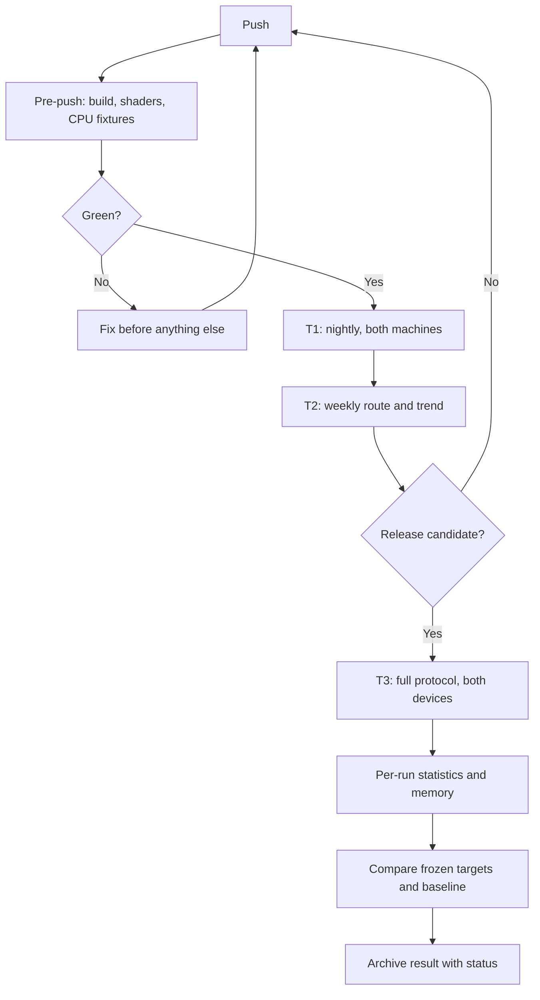

# Benchmarks — release gates and demo qualification

Status: **all results NOT RUN.** Every target here is a proposed acceptance criterion, not a measurement.

Companion files: [Architecture](architecture.md) · [Roadmap](roadmap.md) · [Gates](gates.md) · [CI](ci.md) · [Math](math.typ) · [References](references.md).

**Statuses are authoritative in the [gate registry](gates.md).** Where a table here and that file disagree, the registry wins and this file is corrected.

Hardware, memory budgets and allocation caps live in [architecture.md §2 and §7](architecture.md) and are not restated here. Every numeric target traces to a claim it exists to prove — see architecture D7.

---

## 1. What must be demonstrated

Four independent outcomes: **geometric correctness, useful scaling, bounded memory under real oversubscription, and a responsive playable reveal.** A high source-triangle count proves none of them. A wireframe screenshot proves none of them.

Gates are organized by release, R0–R4, because a release is the thing that ships and the thing a reader can check. Optional follow-on work has BP1–BP3.

Three gates span two releases each, because their halves depend on features the roadmap schedules apart. The suffix is part of the gate name and appears in every result:

| Gate half | Release | Covers |
| --- | --- | --- |
| B1-leaf | R1 | Cooker, leaf clusters, page format, walkable scene |
| B1-DAG | R2 | Hierarchy, projected-error monotonicity, legal cuts |
| B2-selection | R2 | GPU selection, runtime BVH, indirect work, mesh shaders |
| B2-occlusion | R3 | Two-pass HZB, disocclusion recovery |
| B3-streaming | R3 | Residency, oversubscription, throttled I/O |
| B3-temporal | R4 | Materials, shadows, TAA and the numerical Q6 threshold |

A gate half never requires a feature its release has not scheduled. Anything measured before its half is due is recorded as informational and cannot block.

A release passes when its correctness gates and applicable numeric targets pass on **both** qualification profiles, except CPU-only cooker tests, which are Linux-only (architecture D5). Preserve every failure and the revision that fixed it.

**Profile A trails by one release** (architecture D2). Profile A is not gated at R1; from R2 onward it is gated on the **previous** release's feature set — at R2 it must pass R1's gates, at R3 it must pass R2's, and at R4 it must pass everything. This is a deliberate lag with a deadline, not an open-ended exemption. **Every gate result records which release's feature set Profile A was running.** If Profile A falls more than one release behind at a boundary, that is a schedule event, not a footnote.

---

## 2. Protocol, tiered by cost

Running one full protocol pass occupies a laptop exclusively for hours, and that laptop is also a development machine. At two hours a day, an untiered protocol gets skipped, and a skipped protocol protects nothing.

| Tier | When | Cost | Content |
| --- | --- | --- | --- |
| **T1 — CI** | Nightly on both machines, automatically | ~45 min | Correctness fixtures, golden images, cross-backend agreement, one 20 s timed replay, memory caps. Fails the branch. See [ci.md](ci.md) |
| **T2 — Weekly** | Saturday night | ~2 h | One 120 s route per profile, single run, full telemetry, twelve-week trend. Informational |
| **T3 — Gate** | Release acceptance, by hand | ~3 h per device | The full protocol below |

### T3 full protocol

After 10 minutes of thermal preparation on the relevant workload: warm 60 s, replay the fixed 120 s route five times, report each run plus the median of run-level statistics. Compute p50/p95/p99 on individual frame samples within each run — never average FPS and call it latency. Gates require all five run-level p95/p99 values to pass. If the maximum absolute deviation of the five run-level p95 values from their median, divided by that median, exceeds **0.10**, diagnose power, thermal or background effects and repeat the whole affected test. Stating this as "varies by 10%" leaves both the statistic and the denominator ambiguous.

Both machines on AC power at the intended sustained performance mode, with significant background workloads closed. Retain temperatures, power and clocks throughout. On A, additionally record memory pressure, compression, swap deltas and page faults.

Fixed settings for every named tier: release builds with symbols, frozen shaders, identical content revisions, vertical FOV 70°, deterministic replay timestamps, requested LOD error 1.0 px, **no upscaling, no dynamic resolution, no frame generation**. Throughput tests disable VSync; display-paced playability tests run separately at supported refresh rates.

For image comparisons: TAA, jitter, motion blur, auto exposure and every stochastic effect off; fixed seeds and exposure. Also inspect final output with TAA on, and measure temporal stability explicitly (Q6).

### Measurement definitions

- **CPU active frame** — simulation, render preparation and submission, excluding frame-cap and present wait, but including unexpected blocking inside engine work.
- **GPU work** — timestamp or command-buffer duration for the frame's render dependency chain. With async queues, measure critical-path elapsed work and report queue spans separately; never sum overlapping work.
- **Frame interval** — consecutive frame completions or presents in the throughput test. Label the method. A CPU loop duration is not display latency.
- **Input response** — event timestamp to first frame containing the corresponding update. An instrumented engine estimate, not a photon measurement.

Profile with Vulkan validation and GPU captures, NVIDIA GPU timing, Metal API and shader validation, Metal captures and Instruments. Disable validation and heavyweight capture in timing runs and record their state. [Apple profiling tools](https://developer.apple.com/metal/)

### Streaming modes

| Mode | Initial state | Measures |
| --- | --- | --- |
| Warm traversal | Shaders compiled, expected working set warmed | Steady rendering cost |
| Engine-cold | Process restarted, pool empty except startup roots, OS cache may be warm | Engine residency and publication |
| Storage-cold | Process restart plus a documented method that removes or avoids OS cache | End-to-end storage behaviour |

Do not label a run storage-cold unless that state was actually established. If it cannot be, report it unavailable and run the deterministic throttled-I/O test instead; state the gap in the release report rather than substituting warm numbers.

Throttled I/O injects a reproducible **256 MiB/s read limit plus 10 ms fixed request latency** into the engine's I/O scheduler with recorded concurrency. This is a stress fixture, not a claim about the SSD. Also inject page read failures, checksum failures, delayed GPU completion and a tiny pool.

---

## 3. Correctness definitions

| Code | Definition and pass condition |
| --- | --- |
| Q0 | Zero invalid indices, nonfinite positions, out-of-bounds shader accesses, validation errors, stale page generations, silent queue or token overflows |
| Q1 | Every legal DAG cut covers each source region exactly once; shared nodes never emitted twice; all group members use coherent decisions; compatible seam vertices decode to identical positions; zero internal crack pixels on shared-border fixtures |
| Q2 | At a 1.0 px target, sampled silhouette distance p99 ≤ 1.5 px and max ≤ 3 px versus source on S1/S2; every selected resident group's declared error ≤ target unless explicitly classified as fallback; report exceptions |
| Q3 | With identical selected geometry, raster coverage and depth agree with the hardware reference away from a one-pixel silhouette and tie band: zero missing interior pixels; depth agreement for 99.99% of covered pixels, reported **both** as ≤ 2×10⁻⁵ normalized **and** as a view-depth-relative or ULP figure. Under reversed-Z with $n$ = 0.1 m, 2×10⁻⁵ of normalized depth spans about 2 mm at 10 m and about **2 m at 100 m** — a fixed normalized tolerance is not a fixed spatial tolerance. Investigate every larger error |
| Q4 | HZB enabled versus disabled: zero falsely missing interior visible pixels, including the first frame after disocclusion or camera cut |
| Q5 | Cross-backend geometry masks satisfy Q3; deterministic unlit linear-RGB MAE ≤ 1/255 excluding documented tie and edge pixels; material differences also get visual review. **Exact identity comparison applies only between paths rendering matched topology with stable IDs** — hardware versus compute raster, or Vulkan versus Metal. Source-versus-LOD comparisons have no shared ID space and are judged on depth, coverage and geometric deviation instead |
| Q6 | **Temporal stability.** Candidate-minus-**reference** residual on aligned valid samples, reported as temporal bias, RMS and variance, with the excluded disocclusion and motion fraction frozen and capped. The reference is a **finest-detail render on tractable fixtures** — LOD pinned to the leaf level — so LOD-induced temporal error is isolated from legitimate change; two runs of the same renderer are not a reference. Motion vectors are validated independently on known camera and rigid motion **before** they are used to align. Separate calibration and evaluation captures. A raw frame difference conflates motion with error and is not the metric. Threshold calibrated at R4 and frozen. Informational before R4, because TAA does not exist until then |

Q2 is a finite-corpus quality gate, not a proof of the error envelope; validate construction bounds independently with hierarchy invariants. Classify legitimate silhouette shifts separately from internal cracks.

**The tie band is a liability, not a licence.** Build it independently of the comparison it exempts, from geometry rather than from the diff. Cap its area, report that area in every result, and never let it mask an internal seam, a page hole or a systematic raster gap. A band that widens quietly is how a real defect survives for months. Archive raw and masked difference images together with the exclusion mask.

Q6 exists because a 1-pixel error target means LOD transitions happen constantly at sub-pixel scale. Gates that only test still frames cannot see the most likely perceptual failure of this architecture. It becomes a numerical gate only at B3-temporal; before that it produces archived captures and human review, and cannot block a release.

---

## 4. Fixture corpus

Fixtures are created as part of their release. Source and cooked hashes go in a manifest. Cooking is Linux-only. Sizes derive from the content and from what each claim requires as proof (architecture D7).

| ID | Definition | First used |
| --- | --- | --- |
| S0 | 1 M triangles across plane, sphere, cubes, sloped surfaces; fixed overlapping and near-plane cases | R0 |
| S1 | 10 M unique triangles across ten dense rigid meshes with hard edges, UV seams, multiple material sections | **R0** — B0 runs the builder over it, so it is pulled forward. A single 10 M source mesh with no engine format is enough at R0 |
| S2 | ≥ 20 adversarial seam and LOD fixtures: shared borders, thin fins, disconnected leaves, narrow cavities, mirrored instances, nonuniform scale, near-plane crossings | R1 |
| S3 | 100 distinct 100 K-triangle props instanced to 1 K / 10 K / 100 K objects; frozen layouts and seeds | R2 |
| S4 | 10 K props behind occluders, ≥ 90% hidden by oracle; moving door, 180° turns, teleports; matched open variant | R2 |
| S5 | **Zorah geometry demo corpus**, a named and hashed ≈ 320 M-triangle subset. Cooked size and ratio are **measured, not assumed** — the estimate is 9.5 GiB and 9.5:1 against the 1 GiB pool. Working sets are derived from measured byte sets, not asserted; see the residency accounting in [r3-benchmarks §5b](milestones/r3-benchmarks.md). Report the corpus ratio and the route's demanded-byte union separately | R3 |
| S6 | Controlled triangles at median projected areas 0.25, 1, 4, 16, 64 px², each at depth complexity 1, 4, 16; matched coverage per pair | **Only if the R2 histogram justifies it** |
| S7 | 32 PBR variants, textured slanted surfaces, 10 K two-sided leaf cards, bounded wind, four-cascade shadows. Built on the **material corpus** — a small, separately audited UV- and tangent-equipped source, because the Zorah geometry export has neither (D8) | R4, used only by B3-temporal |
| S8 | Final walkable route through the S5 corpus: ≈ 320 M unique, small foliage patch. Close-up detail, an occluding passage and a distant vista must all lie on the route. **The instanced count comes from the subset's own manifest**, never inherited from the full scene's 18.9 G | R4 |
| S9 | **Full Zorah scene**, 1.63 G unique and 18.9 G instanced: 48.6 GiB cooked, **48:1** against the 1 GiB pool, 25.5 M DAG clusters whose 1.52 GiB of metadata exceeds the pool and therefore requires metadata paging. Cook ≤ 90 min under a measured memory admission limit; ≈ 120 GiB of disk once the upstream source, its own render cache and our output are counted — measured before the run | R3, **conditional**: attempted if disk and bake memory allow, `UNAVAILABLE` otherwise |

S9 is the headline. A 48:1 ratio on a published scene that any reader with the same laptop can download and reproduce is worth more than a larger ratio on content nobody else can obtain — and the scene is documented as un-preloadable, so it is a proof that the streaming path is real rather than an assertion. It also gives an external performance reference measured on the same hardware in the same session.

S5 and S9 are the same corpus at two densities, which keeps the asset audit, the import path and the cook pipeline single-sourced. S5 carries every gate; S9 carries the number.

The unique-triangle count is **measured, not assumed**, and the S5 subset is defined by a committed, hashed list of mesh identifiers and instance transforms — not by whatever happened to import. If the subset falls short of the ratio, extend it from the same scene and republish the figure. Padding with near-duplicates fails the claim the number exists to prove, and adding empty pages fails it more obviously. Texture bytes never qualify a geometry streaming test.

For S5, construct four distinct view working sets that each fit inside the 512 MiB stress pool but whose union far exceeds the 1 GiB normal pool. **Measure the working sets; do not derive them from triangle counts.** Freeze the route so at least two transitions require pages absent from the initial resident set, and log request and load events to prove it.

For full-detail quality references that cannot fit at once, render deterministic spatial subsets or offline tiles from the original geometry with fixed camera and depth conventions, and compare depth and ID masks on a shared grid. **Never use the cooked LOD hierarchy as its own quality oracle.**

---

## 5. Release gates

All start **NOT RUN**. `L/A` means the profile-specific limit in milliseconds. Subsystem timings apply to the named fixture, not to arbitrary future scenes.

### B0 — R0: toolchain, baseline and reference measurement

Every target in this file is currently a guess. B0 replaces several with measurements taken before any engine code exists.

**Procedure:**

1. Build and run [`vk_lod_clusters`](https://github.com/nvpro-samples/vk_lod_clusters) on Profile L with the threedscans scenes and, if bandwidth allows, the Zorah export. Record frame times, geometry pool occupancy, streaming behaviour and triangle counts.
2. Run `clusterlod.h` over S1 and record DAG build time, node counts, reduction per level and peak RSS.
3. Microbenchmark on **both** devices: 64-bit buffer atomic max under contention; 64-bit fragment-stage atomics; **the exact `ulong` atomic max in a compiled MSL kernel**, verified rather than inferred from a feature table; mesh-shader cluster dispatch throughput; `doubleSided` cost on the mesh path; page decode throughput at 64/128/256 KiB.
4. Stand up the Slang toolchain: one non-trivial kernel compiled and running on both SPIR-V and MSL, per-target capability profiles declared, shader hashes wired into the manifest. Pin and record the Slang, meshoptimizer and `clusterlod.h` versions.

**Pass:** measurements recorded in the manifest format below; **the Apple-to-Linux performance ratio derived from them rather than assumed**; Slang building for both targets from a single source; dependency versions pinned; CI green on both machines with a trivial fixture.

### B1-leaf (R1) and B1-DAG (R2): walkable cluster scene, then the hierarchy

The leaf half gates R1; the DAG half gates R2. Pass conditions below are marked with the half they belong to.

**Procedure:** cook S1 three times with a clean cache plus once warm on Linux; compare deterministic outputs. R1 rasterizes through indexed indirect draws; mesh shaders arrive at R2. Render all leaf clusters against the ordinary mesh path. At R2, sweep S1/S2 at 0.5, 1.0, 2.0 and 4.0 px through 1,000 camera and scale configurations including transitions between neighbouring hierarchy depths, with fully resident geometry and CPU selection to isolate the hierarchy from streaming. Compare a permanently locked-boundary tree diagnostic against the regrouped DAG on the same continuous-surface fixtures. Then walk the scene.

**Pass, B1-leaf (R1):** Q0/Q5. Identical seam decode; complete primitive and material coverage; repeated package hashes match on the same toolchain. Position error inside the declared quantization bound; initial quantization target ≤ 10⁻⁵ of bounding-box diagonal. Projected-error monotonicity validated on every tested dependency path including nonuniform transforms and near-plane cases — **scalar monotonicity alone does not pass.** Identical decision inputs within each group; unique cut emission. On fixed distant views of dense continuous S1 surfaces, selected triangles at 1.0 px ≤ 25% of leaf triangles while meeting Q2. Thin and aggregate meshes reported separately, never averaged away. Moving 1 px → 2 px must not increase selected triangle count beyond 1% after settling; hysteresis settles within 10 static frames. Walkable: collision, jump, reset, deterministic replay. Cook budgets met.

**Pass, B1-DAG (R2):** Q1/Q2. Projected-error monotonicity, legal-cut validity, the 25%-of-leaf-triangles figure, the hysteresis conditions and the locked-tree comparison all belong here, because none of them exists at R1.

Q6 is **informational at both halves**: TAA arrives at R4, so temporal captures are archived and reviewed but carry no threshold until B3-temporal.

**Budgets:**

| Budget | Target |
| --- | --- |
| 10 M-triangle clean cook, wall time | ≤ 2 min |
| 10 M-triangle cook, peak RSS | ≤ 8 GiB, with an enforced in-flight triangle cap |
| Encoded leaf geometry | ≤ 16 B per source triangle |
| Hierarchy size | ≤ 2.5× leaf package |
| CPU selector p95, 10 M view | ≤ 10/15 ms — development baseline only |
| Leaf GPU decode and render p95 | ≤ 8/16 ms |

**Also frozen here:** the page size, chosen from the B0 decode and I/O sweep across 64/128/256 KiB. A later change invalidates package hashes and requires a named new baseline.

**Differential oracle:** for every fixture in S1 and S2, compare our group and cluster output against `clusterlod.h`'s own output at the same configuration. Divergence is not automatically a failure — packing and bounds are ours — but an unexplained divergence blocks the gate.

**Evidence:** cook wall time and RSS, raw and encoded sizes, hashes, quantization histogram, legal-cut validator output, oracle diff, DAG versus locked-tree per-level locked-edge density and reduction, seam masks, silhouette distances, selected-triangle curves, hierarchy memory. W1 and W2 use these, and state plainly which parts were integrated and which were written here.

**If the hierarchy half fails:** descend the fallback ladder in [architecture.md §9](architecture.md). Do not proceed to R3 on a broken hierarchy, and do not redefine success by switching to whole-object LOD.

### B2-selection (R2) and B2-occlusion (R3)

**Procedure:** S3 at 1 K/10 K/100 K instances; compare CPU and GPU selected group IDs on a manageable subset under deterministic settings with occlusion off. Measure visited BVH nodes and dispatch count, not only final triangles — the runtime BVH is a distinct structure from the replacement DAG. Then S4 with HZB off and on, plus the matched open scene, testing the first frame after each scripted door opening, 180° turn, teleport and near-plane crossing.

**Pass, B2-selection (R2):** Q0/Q1/Q2. CPU and GPU cuts match with tie and hysteresis state fixed. GPU selection plus compaction p95 ≤ 2/4 ms; CPU scene and render preparation p95 ≤ 2/3 ms. Growing 1 K → 10 K instances with the additions outside the view raises CPU render preparation by ≤ 25% once both runs include identical fixed submission overhead; report absolute times alongside ratios. The overflow test below belongs to this half.

**Pass, B2-occlusion (R3):** Q4, and everything involving S4 and the HZB. In the occluded steady view, reduce raster-submitted triangles by ≥ 80% and total geometry GPU time by ≥ 35% versus HZB disabled. On the matched open scene, total geometry GPU cost rises by ≤ 15%. HZB build plus tests p95 ≤ 1.5/3 ms.

**Overflow test:** force each queue to a quarter of normal capacity. Detect overflow, emit a valid complete fallback cut with zero holes. Normal runs must have zero overflows. Indirect work counts derive from GPU output without a blocking current-frame readback.

**The D6 measurement, ~1 week:** histogram projected triangle area on S3 and an S8 preview at the 1.0 px error target, broken down by depth complexity and **weighted by covered pixels and rasterisation time, not by triangle count**. A scene where most triangles are tiny but most pixels come from large ones will not benefit from a compute rasterizer. Publish the distribution. This histogram decides whether B4-M exists at all, and it is the only thing that reopens D6.

**Evidence:** selected-ID comparisons, BVH work and dispatch counts, per-frame visibility differences, disocclusion captures, both timing distributions, open-scene overhead, the triangle-area histogram. W2 and W3 use these. Temporal false positives are correctness failures even when their average is small.

### B3-streaming (R3) and B3-temporal (R4)

**Procedure:** S5 at the 1 GiB normal pool on each device, the 512 MiB stress profile, and a 256 MiB diagnostic where roots fit. Normal and throttled I/O; 20 alternating teleports across the four working sets. Delay upload completion; corrupt selected non-root pages; force replacement groups to straddle pages with exactly one part or dependency missing. Then run S9. Its additional pass conditions, which S5 cannot exercise:

| S9 condition | Why |
| --- | --- |
| Metadata paging active and correct | 1.52 GiB of cluster records against a 1 GiB pool. The top twelve levels stay pinned at ≈ 8.4 MB; everything below pages with its geometry |
| A resident parent stops safely at a paged-out child | The failure this introduces is a traversal walking into metadata that is not there |
| Achieved ratio reported as decoded bytes, not archive bytes | 48:1 is a decoded-residency claim |
| Cook manifest records thread count and peak RSS | A cook that used sixteen threads and swapped is a different measurement |

If metadata paging is not ready, S9 is reported **unavailable** rather than estimated, and S5's 9:1 still carries the release. At R4, separately, S7 in flat-colour, texture-gradient, normal-map and full PBR modes, sweeping declared maximum wind displacement with moving camera and light.

**Pass, B3-streaming (R3):** Q0/Q1/Q4, on S5 at **≥ 9:1**. An incomplete split group never activates. A valid resident cut survives every eviction. Zero missing fallback surfaces, duplicated regions or stale readers. Total geometry allocation stays within the pool including metadata and roots. No synchronous render-thread page wait. Streaming bookkeeping p95 ≤ 1 ms; upload and copy critical path p95 ≤ 2/4 ms.

Across 20 scripted teleports, at most one may miss its deadline: **1 s on L, 2 s on A** under normal I/O, **3 s / 5 s** under throttle, on working sets that fit the tested pool. This is **finite-corpus acceptance, not a reliability figure** — even 20 successes out of 20 establish only an 86.1% one-sided 95% lower bound on the underlying rate under independence, so no result here may be published as "95% of teleports recover". Tag every result with its pool size.

**The deadline applies to `t_quality`. Both timestamps are reported.** At 30 Hz the 30-frame confirmation window alone costs 1.0 s — half of Profile A's 2 s normal-I/O budget — so gating on `t_confirmed` would fail runs whose data was resident in time. $t_{quality}$ is the first frame at which ≥ 99% of visible pixels meet requested error; $t_{confirmed}$ is the end of 30 consecutive such frames. Confirmation alone costs 0.5 s at 60 Hz and 1 s at 30 Hz — a third of the L deadline. A run that reports only $t_{confirmed}$ against a budget derived for $t_{quality}$ fails for the wrong reason. Report fallback pixels throughout.

**Sanity-check the throttled deadline before treating it as a gate.** At 256 MiB/s a 400 MiB working set costs at least 1.56 s of reads alone; decode, upload, dependency rounds and confirmation consume the rest of a 3 s budget. It is a plausible hypothesis, not an established target, until those components are measured separately. The 256 MiB diagnostic has correctness and boundedness gates but no quality deadline when the working set does not fit.

**Pass, B3-temporal (R4):** everything involving S7, plus the numerical Q6 threshold. S7 is first created at R4, so none of this is measurable at R3. Zero hidden opacity holes promoted to opaque occlusion; zero bounds-culling losses at permitted deformation. Unlit textured MAE ≤ 2/255 outside the declared edge band. Masked fixtures match ≥ 99.9% of coverage pixels. Out-of-envelope deformation is rejected or its bounds expanded before rendering. Full S7 renderer GPU p95 ≤ 18/36 ms; material resolve plus lighting ≤ 7/14 ms.

**Memory pressure:** shared staging counted exactly once in A's caps. Trim optional pages and mips when working-set headroom drops below configured limits, and record the event. Never hide a growing full-dataset CPU cache. Normal runs stay free of sustained swap-driven rendering.

**Evidence:** per-page-size padding, metadata and I/O amplification; requests, read and upload rates; unique resident slots; pinned bytes; eviction and reload rates; time-to-quality; process footprint; incomplete-group captures; shadow-cascade residency and request-class behaviour; leaf thinning, gradient, aliasing and ghosting inspection. At least one traversal must load cumulative decoded geometry exceeding its pool and safely reuse retired slots. W4 uses these.

### B4 — R4: playable reveal, qualification, release

**Procedure:** play S8 manually for 10 minutes per platform, then run the scripted route: close-up detail through an occluding passage into a vista, with jump, collision, reset, interaction and every reveal mode toggled while moving. Then the full T3 protocol on frozen S8: warm, engine-cold, documented storage-cold where possible, deterministic I/O stress. Repeat S2/S4 correctness fixtures after optimization. Install each release on its qualification machine without development-environment assumptions; three clean launches; a 60-minute soak.

**Pass:**

| Gate | L | A |
| --- | --- | --- |
| Frame interval p95 / p99 | ≤ 16.667 / 22 ms | ≤ 33.333 / 45 ms |
| GPU p95 | ≤ 14 ms | derived from B0's measured L:A ratios, **per workload** — bandwidth, raster, decode and CPU preparation need not scale alike, and a single scalar ratio hides that. The A30 frame-pacing requirement is independently binding regardless |
| CPU active p95 | ≤ 5 ms | as above |
| Engine-cold time to controllable first frame | ≤ 15 s | ≤ 15 s |
| Reveal-only GPU overhead p95 | ≤ 1 ms | ≤ 2 ms |
| Input-to-updated-frame p95 | ≤ 50 ms | ≤ 80 ms |
| Warm-route hitch frames — **50 ms on L is 3× its budget, 66.67 ms on A is 2× its** | > 50 ms: ≤ 0.1% | > 66.67 ms: ≤ 0.1% |
| 30-min soak: p95 degradation, first versus last 5 min | ≤ 15% | ≤ 15% |
| 60-min soak: net unexplained tracked memory growth after 10 min | ≤ 64 MiB | ≤ 64 MiB |

Q0–Q6 where applicable; all caps from architecture §7; no in-route shader compilation after prewarming; zero crashes, GPU hangs, unrecoverable page errors or validation defects in correctness runs; reveal colours correspond to the captured selected geometry; the page-residency reveal demonstrates new pages arriving after leaving the initial working set; the qualitative reveal criteria in architecture §8 are met.

**L120 is measured and reported with no budget table and no pass/fail status.**

**Scaling experiments are `diagnostic`** in the [gate registry](gates.md) — curves, not gates. At 720p/1080p/1440p report geometry, shading and total GPU time. At 1×/2×/4× source tessellation of the same continuous surfaces with camera, coverage and error target fixed and residency fully available, geometry GPU time and selected triangles are expected to grow by less than about 25% from 1× to 4× on the preselected non-pathological fixture. **That figure is a reference expectation, not a pass condition** — deviation from the fixture's frozen curve is the signal. This tests useful LOD behaviour; it is not an O(pixels) proof. Add fully occluded instances at 1×/2×/4× S4 scale: submitted triangles are expected to rise by less than about 10%, again as a curve rather than a gate; report traversal cost even when raster work stays flat. Run foliage, open-scene and overdraw cases separately with no universal constant-cost claim.

**Evidence:** release archives, source revision, installation instructions, asset notices, machine manifests, raw samples, memory accounting, variance, scale curves, sustained thermal and power curves, any unavailable measurements, and a short demonstration video alongside — not instead of — the playable build. Benchmarks must be runnable by the other developer from the written instructions with no undocumented manual preparation.

### B4-M — conditional: hybrid small-triangle rasterization

**This gate exists only if the R2 histogram showed a material fraction of rasterisation work below ~1 px².** If it did not, record that finding, skip this gate, and publish it. A measured negative is a better article than an unmeasured feature.

The histogram is the only decision point. The default is no, nothing in R1–R3 depends on the answer, and the question is not reopened on the strength of an intuition.

**Procedure:** S6 under hardware-only, compute-only, and hybrid dispatch with identical selected triangles. Every size and depth-complexity cell, plus clipping, equal-depth, tiny-sliver and high-contention cases. Try the shared 64-bit atomic target first; fall back to separate attachments plus merge only if a device refuses, and measure the merge cost when you do (architecture D6b).

**Pass:** Q0/Q3/Q5. On each qualification GPU, at least one preregistered cell with median area ≤ 1 px² achieves **≥ 2.0×** speedup in total visibility time versus hardware-only. Total visibility includes classification, rasterization, clearing and merge. The full sweep's median hybrid time must not exceed hardware-only by more than 10%; the classifier may route hardware-favourable cells entirely to hardware. Report 64-bit atomic contention and scratch-buffer peaks. Freeze per-device crossover thresholds from a calibration subset, then evaluate on held-out camera variations.

---

## 6. Regression policy and evidence format

Compare against the last passing revision on the **same** machine, configuration and content hashes. Investigate > 5% p95 or > 10% p99 regression when it repeats across the five-run protocol and exceeds measured noise. A regression is acceptable only with a recorded reason and still-passing hard caps; it never silently moves the baseline. Correctness failures always block, regardless of speed improvements.



Benchmark interface, implemented at R0 and extended over time:

```bash
vg_bench --backend vulkan --scene S8 --route final_v1 --profile L --tier T3 --runs 5 --out results/B4-L
vg_bench --backend metal  --scene S8 --route final_v1 --profile A --tier T3 --runs 5 --out results/B4-A
vg_bench --backend vulkan --scene S5 --mode engine-cold --io-mib-s 256 --io-latency-ms 10 \
         --geometry-mib 512 --out results/B3-L-stress
vg_bench --tier T1 --all-fixtures --out results/ci/$(git rev-parse --short HEAD)
```

Each result bundle contains `manifest.json`, frame and streaming samples as CSV or JSONL, aggregate JSON, correctness images and masks, run logs, and a short Markdown interpretation. The manifest records the actual command and:

```json
{
  "release": "R4",
  "benchmark": "B4",
  "tier": "T3",
  "status": "NOT_RUN",
  "source_revision": null,
  "asset_manifest_hash": null,
  "generator_seed": null,
  "cooker_version": null,
  "shader_hash": null,
  "slang_version": null,
  "clusterlod_version": null,
  "meshoptimizer_version": null,
  "feature_set_release": null,
  "profile_a_trails_by_releases": 0,
  "profile": "L",
  "machine_manifest": null,
  "actual_physical_ram_gb": null,
  "actual_gpu_core_count": null,
  "gpu_power_limit_w": null,
  "memory_profile": "normal",
  "geometry_pool_mib": 1024,
  "cooked_geometry_gib": null,
  "oversubscription_ratio": null,
  "resolution": [1920, 1080],
  "lod_error_px": 1.0,
  "raster_path": "mesh_shader",
  "mode": "warm",
  "runs": 5,
  "warmup_seconds": 60,
  "route_seconds": 120,
  "measured_frame_p95_ms": null,
  "measured_frame_p99_ms": null,
  "measured_gpu_p95_ms": null,
  "measured_cpu_active_p95_ms": null
}
```

**Selected triangles are a scaling observable, not a bound.** A 1 px error target implies no universal triangle count: a flat rectangle is exact with two triangles, and layered thin geometry can need millions. The figures of 0.5–2 M main-view and 1–3 M including cascades are **corpus-specific expectations** shown on the HUD from R2, never pass conditions.

The defect test is deviation from a **frozen reference curve on a named fixture**, not membership of a band. The controlled experiment is 1×/2×/4× tessellation of the same surfaces with camera, error target and residency fixed — the B4 scaling experiment, which that section already correctly labels as not an O(pixels) proof. Carry that wording wherever the figure is quoted.

Minimum telemetry: unique and instanced source triangles; selected and raster-submitted triangles by path; selected groups and tested instances; visible pixels; HZB rejections and recovered clusters; requests and actual read and upload bytes; pinned and resident geometry; textures and transients; queue peaks and overflows; per-frame CPU and GPU times; error-fallback pixel fraction; oversubscription ratio; temporal-variance metric. Instrumentation overhead must itself be measured and kept below 2% of total GPU time in standard timing runs, or reported explicitly.

---

## 7. Editorial acceptance

Five posts, each shipping with a release (architecture §10). All **NOT WRITTEN** at planning time.

| Gate | Post / benchmark | Claim to substantiate |
| --- | --- | --- |
| E-W1 | W1 / B1-leaf | Cook time and memory, quantization error, bytes per triangle, the frozen page format, and honest attribution of what was integrated versus written |
| E-W2 | W2 / B1-DAG, B2-selection | Locked-tree versus regrouped-DAG behaviour, unique cuts, monotonic projected error, seam evidence, runtime BVH workload, CPU/GPU cut agreement, real indirect execution on each backend in scope |
| E-W3 | W3 / B2-occlusion | Same-frame recovery, correct previous transforms, quantified open-scene cost, contrast with simpler single-pass approaches |
| E-W4 | W4 / B3-streaming | Complete group activation, page-size tradeoff, the achieved oversubscription ratio, unified-memory accounting, external-corpus stress result |
| E-W5 | W5 / B4, B4-M | Playable actual-geometry reveal, final L60/A30 results, L120 as a labelled measurement, and the compute-rasterizer measurement including a negative outcome if that is what it was |

For each post, the other developer reproduces one representative command and checks every published number against archived raw data. Require an original diagram with valid syntax, correct units and axes, linked revision, asset and config hashes, exact one-based PDF citations where relevant, explicit separation of reference technique from project adaptation, a limitations paragraph, and no placeholder represented as a measurement. **Attribute integrated third-party work clearly** — a post describing `clusterlod.h` output as though hand-written fails this gate.

Acceptance means publish-ready, not posted. A negative result is publishable when correctly measured; it cannot claim a supporting release passed if it did not.

---

## 8. Optional follow-on gates

Applicable only if the matching roadmap extensions are undertaken. Reuse the original profiles and reporting rules; freeze new fixture versions before optimizing.

| Gate | Scope | Functional evidence | Numeric gate |
| --- | --- | --- | --- |
| BP1 | Broader programmable raster materials: 128 variants, 100 K masked leaf instances, runtime swaps, bounded deformation | Conventional-reference opacity and deformation comparison; no invalid bounds or missing interior coverage; all supported variants on all backends | Unlit MAE ≤ 2/255, coverage ≥ 99.9%; CPU p95 ≤ 5/8 ms; full GPU ≤ 20/40 ms; zero post-prewarm compilation hitches |
| BP2 | Multi-view selection: one main view plus four cascades, 1,000 independently moving rigid pieces | Correct per-view cuts, motion bounds, fallback shadows, request priorities; no stale-page readers across views | Pool stays 1 GiB; total GPU p95 ≤ 20/40 ms; camera time-to-quality ≤ 25% slower than with shadow streaming disabled |
| BP3 | Production asset resilience, ≥ 32 GiB cooked scenes, content workflows, expanded device qualification, corrupted corpus | No missing covering cuts; bounded traversal and streaming queues; cooker diagnostic for every rejected input; each named extra device passes its claimed subset | Main-view GPU p95 ≤ 20/40 ms; CPU ≤ 6/10 ms; caps per architecture §7; 4-hour soak, no crash, ≤ 128 MiB unexplained growth after warm-up |

A spatially distributed instance population is not a promise to render that many simultaneously visible objects at those timings. Publish visible candidates, traversal work, selected triangles and every memory cap. Optional device support requires its own profile, never inferred from a similar product name.

---

## 9. Comparing against other implementations

**Against `vk_lod_clusters`:** same machine, same Vulkan version, matched resolution, matched camera, documented settings on both sides. Freeze and record its **exact revision, supersampling factor, raster mode, shading configuration and streaming state** — its defaults include supersampling, which changes triangle sizes in pixel terms and therefore changes the very quantity under comparison. It also uses a fork of the upstream builder and documents historical occlusion artifacts; both belong in the result notes. It renders geometry with basic shading, so compare against our geometry passes only, never against the full frame. State its cluster configuration, streaming settings and raster path. This comparison is fair because it is the same hardware on the same day with an available reference.

**Against Unreal Engine:** use assets permitted in both engines, matched cameras and output resolution, documented Nanite settings, comparable lighting, material and shadow cost. Report the exact UE build, OS, backend, scene settings and hardware. If UE cannot run the equivalent native path on a qualification machine, report that limitation and keep the result non-comparable — do not substitute a different OS or GPU and publish a speed ratio. Include difficult foliage as well as favourable opaque surfaces, since workload-dependent limits are exactly where a small engine can look misleadingly good. [UE 5.2 reference](https://dev.epicgames.com/documentation/en-us/unreal-engine/nanite-virtualized-geometry-in-unreal-engine?application_version=5.2)

Passing this suite establishes the project's stated demo capabilities on named hardware. A broader parity claim needs a separately defined feature matrix and workload corpus. No external comparison is required to prove the executable is playable and performs a real streamed geometry reveal.

---

## 10. Reference

**S21:** Karis, Stubbe and Wihlidal, *Nanite: A Deep Dive*, SIGGRAPH 2021. [Public PDF](https://advances.realtimerendering.com/s2021/Karis_Nanite_SIGGRAPH_Advances_2021_final.pdf). One-based PDF page numbers.

Test mappings: B1-DAG → pp. 31–33, 45–48, 63–66; B2-selection → pp. 69–74; B2-occlusion → p. 75; B3-streaming → pp. 122–130; B4-M → pp. 79–93. These explain the technique under test. They do not import the slides' hardware performance, imply a complete UE implementation, or substitute for measurements on these two laptops.
