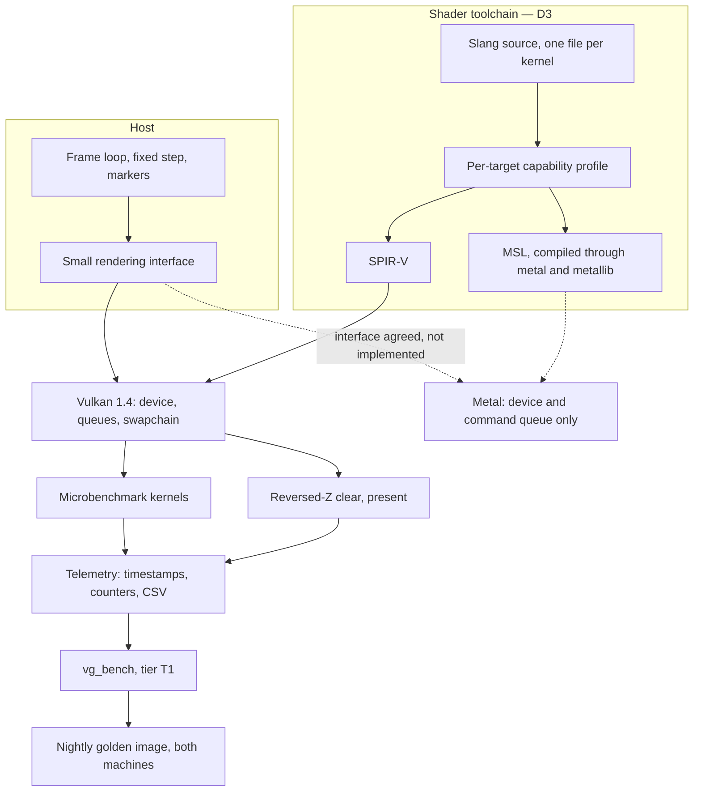

# R0 — Toolchain, measurement and harness

**Weeks 1–14 · 224 team-hours · gate [B0](r0-benchmarks.md) · no post**

Parent documents: [Gates](../gates.md) · [Architecture](../architecture.md) · [Roadmap](../roadmap.md) · [CI](../ci.md) · [Math](../math.typ) · [References](../references.md)

---

## 1. Entry state

An empty repository. Decisions D0–D5, D7 and D8 are taken and recorded; D6 and D6b are deferred to R2 by design.

## 2. Objective

Two things, and almost no engine.

**Replace guesses with measurements.** Every performance target in the benchmark contract is currently invented. R0 measures the reference implementation on the actual hardware, measures both GPUs directly, and derives the Apple-to-Linux ratios instead of assuming a scalar 2×.

**Stand up what every later release depends on.** Single-source shaders, and a nightly golden-image job on both machines. Neither is interesting to build and both become impossible to retrofit.

This is the highest-leverage fourteen weeks in the plan precisely because it produces so little. A surprise in Slang or `clusterlod.h` arriving in week 6 is an inconvenience; the same surprise in week 60 is a re-plan.

## 3. Pipeline at the end of R0

There is no geometry in this diagram. That is correct for R0.

## 4. Deliverables by module

| Module | Owner | Must do | Done when |
| --- | --- | --- | --- |
| `core/`, `platform/` | B | Job system, file I/O, error type, logging, monotonic clock, window and input | A fixed-step loop runs and exits cleanly under ASan |
| `rhi/` | A | Resource, pipeline, submission and capability-query surface. Backend-agnostic vocabulary, no Vulkan nouns in the interface | B has reviewed every signature and can name the Metal implementation of each |
| `backends/vulkan/` | A | Device selection with an explicit feature chain, queues, swapchain, timestamp queries with valid-bit and period handling | A reversed-Z cleared frame presents; timestamps calibrate against a known-duration workload |
| `backends/metal/` | B | Device, command queue, `CAMetalLayer` surface, **and the probe harness**: pipeline creation, resources, submission, readback and a minimal offscreen geometry path. The B0 probes require all of it on both devices | A cleared drawable presents and every probe runs. Feature parity is not expected and not attempted |
| `shaders/` | Both | Slang build integration, capability profiles per target, shader hashing into the manifest | One non-trivial kernel runs on both SPIR-V and MSL from one source |
| `bench/` | B | `vg_bench` skeleton, manifest schema, result-bundle layout | A T1 run emits a schema-valid bundle |
| `ci/` | B | Self-hosted runners, overnight schedule, cancel-on-login, push validation, golden-image harness | Green on both machines with one trivial fixture — this is the B0 exit criterion |
| `tools/cache/` | B | Content cache keyed by input hash, cooker version, settings | Reads on both machines, writes from Linux only |

## 5. Contracts frozen this release

| Contract | Content | Why now |
| --- | --- | --- |
| Depth convention | Right-handed, `[0,1]`, reversed Z, near = 1, clear = 0, greater-than test | It touches the projection matrix, the HZB reduction direction and the visibility key. Changing it later touches everything ([math §1, §3](../math.typ)) |
| RHI vocabulary | Operation names, resource lifetimes, submission shape | Metal implements against it from R1. An interface only Vulkan ever exercised acquires Vulkan-shaped assumptions |
| Manifest schema | Machine manifest, result-bundle layout, pinned dependency versions | Every later result is compared against R0's, so the schema has to survive |
| Slang capability profiles | Required capability set declared per kernel | This is the mechanism that fails a Metal-incompatible kernel on push instead of on device eighty weeks later |
| Pinned versions | Slang, meshoptimizer, `clusterlod.h`, recorded in every manifest | A `clusterlod.h` bump is a content-format change; treat it as one from the start |

## 6. Measurements to produce

Each replaces a specific invented number.

| Measurement | Replaces |
| --- | --- |
| `vk_lod_clusters` on Profile L: frame times, pool occupancy, streaming behaviour | The belief that L60 is reachable at all |
| `clusterlod.h` over a 10 M-triangle mesh: build time, node counts, reduction per level, peak RSS | The cook budgets in D4, and the DAG-size arithmetic in D7 |
| 64-bit buffer atomic max under contention, both devices | The visibility-key design's feasibility |
| 64-bit fragment-stage atomics, both devices | D6b's default choice of a shared target |
| The exact `ulong` atomic max **in a compiled MSL kernel** | A vendor-table claim that may not survive contact with the compiler |
| Mesh-shader cluster dispatch throughput, both devices | D3b's assumption that mesh shaders are the right primary path |
| `doubleSided` cost on the mesh path | The foliage material's budget at R4 |
| Page decode throughput at 64 / 128 / 256 KiB | The page size frozen at R1 |
| Per-workload Apple-to-Linux ratios | The single scalar 2× that every A-profile target currently assumes |

Record GPU family, SDK, MSL version, address space and shader stage alongside each atomic result. The vendor feature table is not the check.

## 7. Metal at the end of R0

Device, command queue, a cleared drawable. The interface is co-developed and reviewed; the implementation is not started. Profile A is **not** a qualification profile at R0 and is not gated.

## 8. Deliberately absent

**No production geometry pipeline.** The cooker, clusters, LOD, culling, streaming, materials, lighting, the game shell. Building any of it before the toolchain exists means writing it twice.

This is not the same as no geometry. The B0 probes — mesh-shader dispatch, `doubleSided` cost, fragment atomics, decode throughput — require pipelines, resources, submission, readback and minimal offscreen geometry **on both devices**. Budget a **probe harness** explicitly: disposable or reusable, but not free, and not a renderer. It is also what makes Apple *portability* qualification distinguishable from later renderer qualification.

## 9. Exit

[B0](r0-benchmarks.md) green. In one line: measurements in the manifest, the Apple-to-Linux ratios derived rather than assumed, Slang building for both targets from one source, CI green on both machines, dependency versions pinned.

## 10. Risks specific to R0

| Risk | Signal | Response |
| --- | --- | --- |
| Slang's MSL output is unusable for a kernel we need | The compiled-kernel atomic probe fails or produces bad code | One documented per-kernel escape to hand-written MSL. If more than one kernel needs it, D3's cost model is wrong and D2's 500-hour Metal figure moves toward 800 |
| `clusterlod.h` does not behave as documented | Build time, node counts or reduction depart from published figures | Raise it before R2 depends on it. The differential-oracle plan assumes it is trustworthy |
| Self-hosted runners are more work than budgeted | CI bootstrap overruns 50 h | Cut to golden images on Linux only, add macOS at R1. Do not cut the golden-image job itself |
| The reference implementation will not run on Profile L | Build or driver failure | Report it. The performance picture then rests on published figures alone, which is a materially weaker position and belongs in the risk register |
