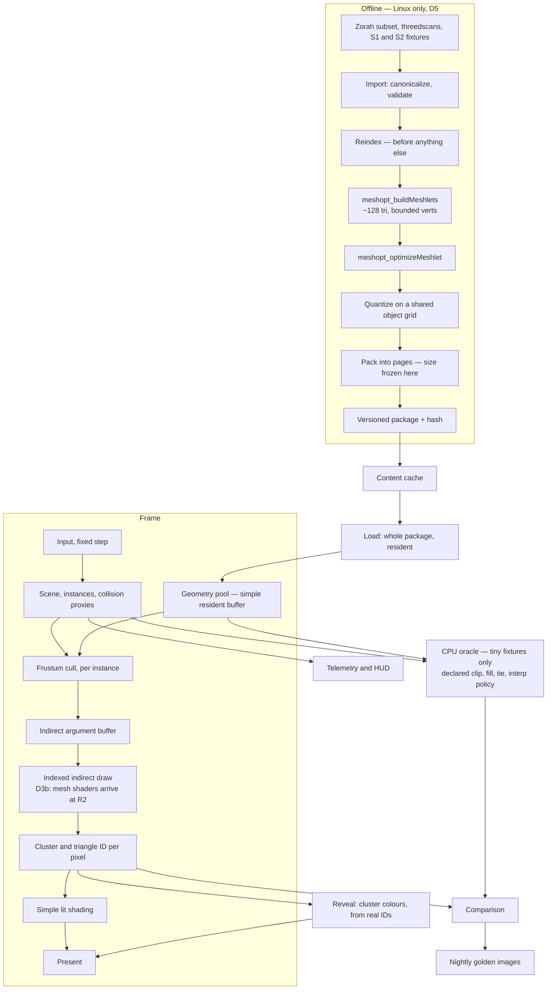

# R1 — Walkable leaf clusters

**Weeks 15–45 · 488 team-hours · gate [B1-leaf](r1-benchmarks.md) · post W1**

Parent documents: [Gates](../gates.md) · [Architecture](../architecture.md) · [Roadmap](../roadmap.md) · [CI](../ci.md) · [Math](../math.typ) · [References](../references.md)

---

## 1. Entry state

From R0: the RHI and its Vulkan implementation, a Metal device and queue, Slang building both targets from one source, nightly golden images on both machines, `vg_bench` emitting schema-valid bundles, a content cache, and a manifest full of measurements including the page-size sweep.

## 2. Objective

The vertical slice. Cook real geometry into clusters, draw it with ordinary indexed indirect draws, and walk around inside it. **No LOD, no streaming, no occlusion culling.** Everything is resident, everything is leaf level.

This is the first release that produces something a person can run, nine to eleven months in. That is its main purpose and it is worth more than any feature in it.

## 3. Pipeline at the end of R1

## 4. Deliverables by module

| Module | Owner | Must do | Done when |
| --- | --- | --- | --- |
| `tools/cooker/import` | B | glTF 2.0 and a dense triangle-mesh path. Canonicalize units, winding, handedness, material sections. Report invalid indices, nonfinite values, zero-area faces, disconnected components, nonmanifold edges. Retain UV, colour and normal seams | An unsupported input is rejected with an actionable message, never silently corrupted |
| `tools/cooker/reindex` | B | **Reindex before anything else.** Published glTF carries 90 M vertices for 30 M triangles | Vertex count collapses to something near the true count on the Zorah subset |
| `tools/cooker/cluster` | B | `meshopt_buildMeshlets` at ~128 triangles and bounded local vertices. Split at attribute discontinuities and vertex limits. Partition by material | No cluster exceeds either cap; the triangle index fits its field by construction |
| `tools/cooker/quantize` | B | Shared object-coordinate grid, ≥ 16 bits per axis. Seam vertices decode bit-identically | Duplicated seam vertices produce identical decoded positions across clusters ([math §12](../math.typ)) |
| `geometry/format` | B | Page layout, cluster records, asset header, layout hash. **Freeze the page envelope here** | A package round-trips byte-identically; a mismatched layout hash is rejected before any buffer is filled |
| `tools/assets` | B | Download, licence audit, hash and archive every source. Define the Zorah demo subset as a committed list of mesh identifiers and instance transforms | Every licence text is in the manifest, and the subset is reproducible from its hash |
| `renderer/geometry` | A | GPU cluster decode, per-instance frustum cull, indirect argument fill, indexed indirect draw | A cooked package renders and matches the ordinary indexed renderer |
| `renderer/visibility` | A | Cluster and triangle identity per pixel | The reveal reads real IDs, not a second low-poly mesh |
| `renderer/lighting` | A | Unlit, then simple lit. No PBR, no shadows | Enough to see the scene |
| `game/` | B | First-person controller, collision proxies, jump, reset, deterministic replay | A person walks a route and the replay reproduces it frame for frame |
| `tools/inspect` | A | Cluster-colour reveal, frozen-camera inspection | Colours correspond to captured selected geometry |
| `eng/tst` | A | CPU oracle for **tiny correctness fixtures only**, with a declared clipping, fill, depth-tie and interpolation policy. It consumes the same independently specified geometry and camera as the GPU path; it is not a third production renderer, and larger comparisons use the indexed hardware path | Golden ID masks exist for the small fixtures and CI diffs against them |

## 5. Contracts frozen this release

**The page envelope.** Size chosen from R0's decode and I/O sweep across 64 / 128 / 256 KiB. Also frozen: the versioning policy, alignment and the header layout.

Before freezing, run **one builder-generated multi-page group** through the format tests, even though the R1 renderer ignores its hierarchy. Otherwise R2 discovers that group records, closure references or alignment do not fit a format already shipped and described in W1. Reserve a named schema revision for R2's payload additions.

**The quantization grid.** Shared per asset, not per cluster. This is what makes seams crack-free by construction rather than by tolerance.

**Collision proxies are cooked separately** and never depend on render-page residency. Easy to get wrong once streaming exists; impossible to retrofit.

## 6. Algorithms and where they are specified

| Work | Reference |
| --- | --- |
| Reversed-Z projection, depth conventions | [math §1, §3](../math.typ) |
| Quantization grid sizing, seam decode equality | [math §12](../math.typ) |
| Cluster partitioning, vertex-cache ordering | meshoptimizer manual; Garland & Heckbert 1997 for the error background |
| Cooker threading: descending-size scheduling, in-flight triangle cap, per-thread arenas | *Billions of triangles in minutes*; D4 |

## 7. Metal at the end of R1

The interface is co-developed against a real second implementation. Metal implements resource creation, buffer upload and a cleared presented frame — enough to keep the RHI honest, not enough to render a cluster. **Profile A is not gated at R1.** Metal implements R1's feature set during R2.

## 8. Deliberately absent

LOD of any kind. The DAG. Streaming and eviction. Occlusion culling. Mesh shaders. Material resolve, PBR, shadows, TAA. The compute rasterizer. All of it is scheduled, and none of it belongs in a release whose job is to prove the cooker and get a person walking.

## 9. Exit

[B1-leaf](r1-benchmarks.md) green, and a build that runs on a clean machine. **Post W1** ships with it, describing a page format that has stopped moving.

## 10. Risks specific to R1

| Risk | Signal | Response |
| --- | --- | --- |
| The page envelope is frozen wrong | R2's group records do not fit | The multi-page-group test above exists to catch this. If it still happens, use the reserved R2 schema revision and take a named new baseline — do not quietly widen the format |
| Zorah's licence is narrower than assumed | Licence text read at R1 | Blocking, and single-sourced: Zorah carries the whole corpus. Discover it here, not at R3 |
| The subset does not carry the demo route | No close-up detail, occluding passage and vista on one path | Extend the subset from the same scene. Shaping it is R3 work but the requirement is known now |
| Quantization error exceeds its budget | Seam decode differs, or position error above 10⁻⁵ of the diagonal | Raise bits per axis. The error is part of the LOD envelope and cannot be carried separately |
