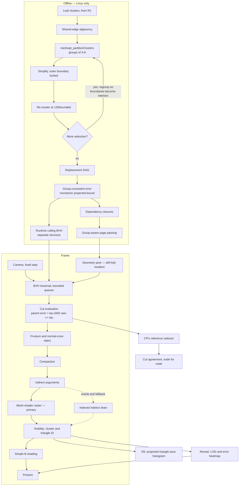

# R2 — LOD on the GPU

**Weeks 46–100 · 882 team-hours · gates [B1-DAG and B2-selection](r2-benchmarks.md) · post W2**

Parent documents: [Gates](../gates.md) · [Architecture](../architecture.md) · [Roadmap](../roadmap.md) · [CI](../ci.md) · [Math](../math.typ) · [References](../references.md)

---

## 1. Entry state

From R1: a deterministic cooker, a frozen page envelope, leaf clusters, an indexed indirect renderer, cluster-ID visibility, a walkable shell, a CPU reference rasterizer, and an audited corpus with the demo subset defined.

## 2. Objective

The largest release and the one holding the real research risk. Three things that must land together:

**A cluster DAG with monotonic projected error.** Integrated from `clusterlod.h` (D0), but the bounds, dependency closure, page packing and cut validator are ours — and that is where the gate's risk actually sits.

**Selection on the GPU.** A runtime BVH distinct from the replacement DAG, traversal with bounded queues, indirect argument generation, and no per-cluster CPU work.

**Mesh shaders as the primary raster path** (D3b), with indexed indirect draws retained permanently as oracle and fallback.

Plus one measurement that decides a fifteen-week question: the **D6 experiment**, run in the last four weeks of R2.

## 3. Pipeline at the end of R2

## 4. Deliverables by module

| Module | Owner | Must do | Done when |
| --- | --- | --- | --- |
| `tools/cooker/dag` | B | Integrate `clusterlod.h` at the pinned version. Adjacency, grouping, locked-boundary simplification, re-clustering, regrouping | The regrouped DAG beats a permanently locked-boundary tree on per-level locked-edge density, measurably |
| `geometry/bounds` | B | Group-consistent error and projection bounds. Force monotonicity where construction violates it | No child's projected error exceeds its parent's on any dependency path, under nonuniform transforms and near-plane cases ([math §8](../math.typ)) |
| `geometry/closure` | B | Dependency closure per replacement group, serialized into pages | A group's closure is loadable as a unit; a partial group is detectable |
| `geometry/format` | B | Group records and closure references, using the R2 schema revision reserved at R1 | Layout hash covers the new records; old packages fail loudly |
| `eng/tst/oracle` | A | CPU reference cut selector, and a **monotonic projected-error validator** | The validator rejects a hierarchy that is only scalar-monotonic. A validator that checks scalar monotonicity alone will pass a broken hierarchy |
| `eng/tst/diff` | B | Differential oracle against `clusterlod.h`'s own group output | Every S1 and S2 fixture diffs clean, or the divergence is explained |
| `renderer/bvh` | A | Runtime BVH over group and cluster candidates — **a different structure from the DAG** | Nodes reachable by index from a bindless buffer, no pointer chasing |
| `renderer/traversal` | A | Level-wise bounded dispatch, cut evaluation, frustum and normal-cone rejection, compaction | Terminates on every asset; overflow produces a complete fallback cut, never a hole |
| `renderer/raster` | A | Mesh-shader path with per-primitive culling; indexed indirect retained | Both paths produce identical ID masks on the fixtures |
| `renderer/instrument` | A | Projected triangle-area histogram, weighted by covered pixels and rasterisation time | The D6 measurement, ≈ 1 week |
| `tools/inspect` | A | LOD level and error heatmap; independent camera and LOD freeze | Frozen state is clearly labelled as frozen |

## 5. Contracts frozen this release

| Contract | Content |
| --- | --- |
| Replacement semantics | A valid cut covers each surface region exactly once. Parent coverage is suppressed only when the entire compatible finer group is active. Shared DAG nodes are never emitted twice ([math §16](../math.typ)) |
| Error representation | Group-consistent, monotonic in **projected** error, with quantization folded in |
| Selection predicate inputs | Every member of a group uses identical decision inputs. Hysteresis applies to coherent group state, never to independent per-cluster thresholds |
| R2 schema revision | Group records, closure references. Named, not a quiet widening of R1's format |

## 6. The D6 measurement

Four weeks at the end of R2, matching the roadmap timeline, and it decides whether a fifteen-week milestone exists. If the branch is taken it needs a priced calendar alternative or a named scope substitution — fifteen weeks does not appear from contingency.

Instrument the mesh-shader path to record, at the 1.0 px error target on S3 and an S8 preview: **triangle-count and projected-area distributions**, covered pixels, depth complexity, and controlled total-visibility timings with the attribution method stated. All of them — weighting only by covered pixels hides the workload under investigation, because tiny triangles covering few or zero samples still cost setup and processing.

It must run at R2 and not earlier: it measures projected area on selected geometry through the mesh-shader path, and neither exists until now.

#### Defining "material fraction" arithmetically

Let *p* be the fraction of baseline total visibility time that a compute rasterizer could accelerate, and *s* the speedup it achieves on that portion. Frame-level benefit is bounded by Amdahl's law:

`S = 1 / ((1 − p) + p/s)`,  with ceiling `S_max = 1/(1 − p)` as `s → ∞`

| *p* | Ceiling | At a realistic *s* = 3 |
| --- | --- | --- |
| 0.2 | 1.25× | 1.15× |
| 0.3 | 1.43× | 1.25× |
| 0.5 | 2.00× | 1.50× |
| 0.7 | 3.33× | 1.88× |

So the threshold is computable rather than a matter of taste. Reaching **2× needs p > 0.50 even with an unbounded inner speedup, and p > 0.75 at a realistic 3×.** Reaching a more modest 1.5× at *s* = 3 still needs p > 0.50.

Write the chosen *p* down before the measurement, with the frame-level benefit it implies and the calendar cost of fifteen weeks beside it. A branch that buys 1.15× is not a close call.

This also bounds what B4M.2 can mean: it gates a **preregistered sub-1 px² cell**, where *p* is near 1 by construction and 2× is attainable. That is a test of the rasterizer, not a claim about the frame. The frame-level number is *S* above, and it is the one that justifies the weeks.

**Define the criterion in writing before reading the result.** Default is no. Publish the distributions either way — a measured negative is better material than an unmeasured feature.

## 7. Metal at the end of R2

Metal implements **R1's feature set**: cooker output loading, leaf cluster rendering, indexed indirect draws, cluster-ID visibility, the walkable shell. **Profile A becomes a qualification profile here**, gated on R1's features, not R2's.

If Metal is more than one release behind at the R2 boundary, that is a schedule event: Vulkan pauses or the descope ladder is used.

## 8. Deliberately absent

Streaming, eviction, the page table. Occlusion culling and the HZB. Materials, PBR, shadows, TAA. The compute rasterizer, unless the histogram reopens it. Geometry is still fully resident — that is R3's problem and mixing it into R2 makes the hierarchy undebuggable.

## 9. Checkpoints inside the release

R2 spans roughly a year. Every six to eight weeks produce a new nightly fixture, a passing correctness bundle, and a build that runs on the other developer's machine.

Order matters: **prove one small adversarial DAG against the independently written CPU selector first**, then add GPU traversal, then scale. A wrong group representation found at week 50 costs weeks; found at week 100 it costs the release.

## 10. Exit

[B1-DAG and B2-selection](r2-benchmarks.md) green on Profile L, B1-leaf green on Profile A. **Post W2.**

If the hierarchy gate fails, descend the fallback ladder in [architecture §9](../architecture.md) — starting by diffing against `clusterlod.h`'s own output, because with an integrated builder our side is the likelier suspect.

## 11. Risks specific to R2

| Risk | Signal | Response |
| --- | --- | --- |
| Projected-error monotonicity fails under nonuniform transforms | Validator rejects on S2 | This is the validator doing its job. Force monotonicity during the build ([math §8](../math.typ)) |
| Cut agreement with the oracle diverges | Node-for-node diff fails | Fix tie and hysteresis state first; they are the usual cause and the cheapest to eliminate |
| Traversal does not terminate or drops nodes | Stress fixture hangs or loses geometry | Bounded level-wise dispatch is the R2 baseline precisely for this. Persistent queues wait for proof on both GPUs |
| Mesh shaders are slower than indexed draws | R0's dispatch measurement, confirmed here | Keep the indexed path as primary and record it. D3b is a measured decision, not a commitment |
| The histogram is inconclusive | No clear sub-pixel mass, no clear absence | Default to no. An inconclusive measurement does not justify fifteen weeks |
