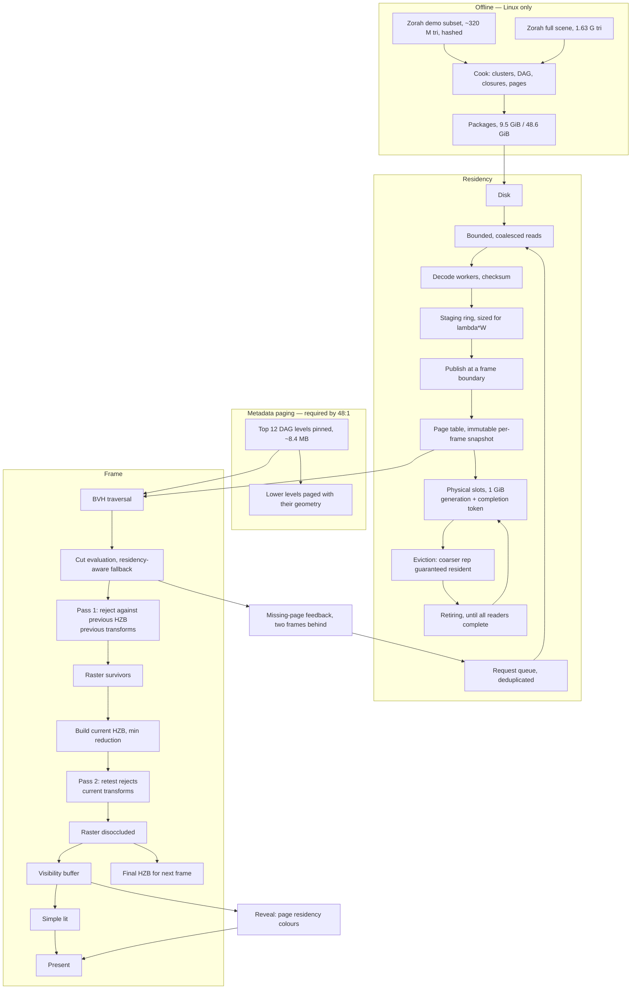

# R3 — Occlusion, streaming and the 48:1 measurement

**Weeks 101–155 · 874 team-hours · gates [B2-occlusion and B3-streaming](r3-benchmarks.md) · posts W3, W4**

Parent documents: [Gates](../gates.md) · [Architecture](../architecture.md) · [Roadmap](../roadmap.md) · [CI](../ci.md) · [Math](../math.typ) · [References](../references.md)

---

## 1. Entry state

From R2: a cluster DAG with monotonic projected error, GPU selection over a runtime BVH, mesh-shader rasterization, a CPU cut oracle, the D6 decision, and a corpus that still fits entirely in the pool.

## 2. Objective

Geometry stops fitting. Three things:

**Two-pass occlusion with same-frame recovery.** Previous transforms for provisional rejection, current transforms for recovery. More expensive than a single-pass test and correct where that one is not.

**Real residency.** A software page table, completion-token lifetimes, split-group activation, eviction that always leaves a complete coarser representation. The demo corpus at **9.5:1**.

**The 48:1 measurement.** The full 1.63 G Zorah scene, which needs metadata paging because its cluster records alone are 1.52 GiB against a 1 GiB pool.

## 3. Pipeline at the end of R3

## 4. Deliverables by module

| Module | Owner | Must do | Done when |
| --- | --- | --- | --- |
| `renderer/hzb` | A | Depth pyramid with **minimum** reduction under reversed Z. Level selection `L = ceil(log2(max(w,h)))` | Each mip is the conservative farthest of its parent, verified against a CPU reduction ([math §11](../math.typ)) |
| `renderer/occlusion` | A | Conservative sphere screen projection; two-pass with previous transforms for rejection and current for recovery; history disabled after a camera cut | Zero falsely missing interior pixels against a culling-disabled reference, including the first frame after disocclusion |
| `streaming/request` | A | GPU feedback, deduplicated, read asynchronously two frames behind. Priority by screen error, coverage, motion prediction, dependency cost | No synchronous render-thread page wait, ever |
| `streaming/io` | B | Coalesced bounded reads, worker decode, checksum before publication | A corrupt or oversized block is rejected before the GPU sees it |
| `streaming/publish` | B | Publication at a defined frame boundary, generation checks, per-frame immutable page-table snapshots | A page becomes visible to a frame only after its upload completes |
| `streaming/lifetime` | B | **Completion tokens**, never CPU frame-count guesses. Slots live until every command buffer using them finishes | The delayed-completion fixture shows no stale reader |
| `streaming/evict` | B | Pin roots, fallback pages and active-cut closures. Before evicting a fine page, guarantee a complete coarser representation remains | The tiny-pool fixture degrades rather than holing |
| `streaming/groups` | B | Split-group activation only when all parts and dependencies are resident | A group with exactly one part missing never activates ([math §16](../math.typ)) |
| `geometry/metapage` | B | **A pinned-byte cap of 32 MiB**, with a measured hierarchy prefix or per-asset frontier chosen to fit it; everything below pages with its geometry. Record actual counts and sizes per record type. Required for the **demo corpus too**, because 305 MiB of records does not fit the 512 or 256 MiB profiles | A small synthetic missing-metadata fixture traverses correctly first; then the full-scene corpus |
| `renderer/shadowlod` | A | Cascade selection in shadow-map texels, looser target, lower-priority request class that cannot evict the camera's fallback closure | Cascades degrade coarser rather than stalling, and the degradation is reported |
| `tools/assets` | B | Define, hash and cook the demo subset; shape it to carry close-up detail, an occluding passage and a vista on one route | The subset is reproducible from its hash and the demo route exists |
| `tools/inspect` | A | Page-residency colours | The view visibly changes as the player moves. If it looks static, the test is not testing streaming |

## 5. Sizing that drives this release

| Quantity | Demo corpus (S5, S8) | Full scene (S9) |
| --- | --- | --- |
| Unique source triangles | ≈ 320 M | 1.63 G |
| DAG clusters | 5.0 M | 25.5 M |
| Cooked geometry | 9.5 GiB | 48.6 GiB |
| Ratio against the 1 GiB pool | **9.5 : 1** | **48 : 1** |
| Cluster metadata at 64 B each | **305 MiB** — fits 1 GiB, **not** 512 or 256 MiB | **1.52 GiB, exceeds every profile** |
| Cook at ≤ 8 threads on the 185H | ≤ 20 min | ≤ 90 min |
| Disk for source, upstream cache and our output | ≈ 15 GiB | **≈ 120 GiB**, measured before the run |

**Check free disk before starting, not during.** Roughly 120 GiB once the upstream source, its own render cache and our cooked output are counted, on a laptop SSD that also holds the content cache and result bundles. Measure it; do not carry the estimate forward.

## 6. Contracts frozen this release

| Contract | Content |
| --- | --- |
| Page lifetime | Completion tokens. A slot is reusable only when every consumer across every queue has signalled |
| Publication | At a frame boundary, into an immutable per-frame snapshot. Generation checks on every dereference |
| Eviction invariant | A complete coarser representation is resident before any finer page is evicted |
| Request classes | Camera requests cannot be starved by shadow requests; shadow requests cannot evict the camera's fallback closure |
| Metadata residency | A **32 MiB pinned-byte cap**; the prefix or frontier that fits it is measured, not assumed. Everything below pages with its geometry |

## 7. Metal at the end of R3

Metal implements **R2's feature set**: the DAG, GPU selection over the runtime BVH, mesh-shader rasterization. Profile A is gated on R2 features here.

This is the boundary where a slip concentrates. Define a **monthly parity slice** through R3 and R4, each naming the subsystem being brought level, and check it at the boundary. Slipping one slice is a schedule event, not a rounding error.

## 8. Deliberately absent

Material resolve, PBR, IBL, cascaded shadow filtering, SSAO, motion vectors, TAA. Shading stays simple so that geometric error and residency behaviour are measurable without a temporal filter in the way. The compute rasterizer, unless D6 reopened it.

## 9. Exit

[B2-occlusion and B3-streaming](r3-benchmarks.md) green on Profile L at ≥ 9:1, B1-DAG and B2-selection green on Profile A. The 48:1 full-scene run is reported with its achieved decoded ratio, **or marked unavailable** — it does not block. **Posts W3 and W4.**

## 10. Risks specific to R3

| Risk | Signal | Response |
| --- | --- | --- |
| Metadata paging does not land | Measured resident union against each profile | The demo corpus gates at 9:1 on the **1 GiB profile only**; the 512 and 256 MiB profiles become infeasible. What is lost is the 48:1 number **and** the stress profiles, not the release |
| Full-scene cook exceeds 32 GB or the SSD | Peak RSS and free disk, measured on the subset cook first | Cap threads at 8, fall back to 4. If disk is short, ship the demo corpus and report the full-scene ratio unavailable rather than estimated |
| The replay never requests new geometry | Request and load event log is quiet | The route is wrong, not the streamer. Four working sets of ≈ 400 MiB whose union is 1.6 GiB, with at least two transitions needing absent pages |
| Use-after-free on a retired slot | Delayed-completion fixture, second-queue consumers | Completion tokens across every queue. A CPU frame-count guess is the bug this fixture exists to catch |
| Shadow cascades double residency demand | Unexplained thrashing when cascades are enabled | The request-class rule. Cascades share the resident cut where the cut allows |
| Two-pass occlusion costs more than it saves on open scenes | Matched open-scene comparison | ≤ 15% is the gate. If it fails, the conservatism is too coarse, not the scheme wrong |
