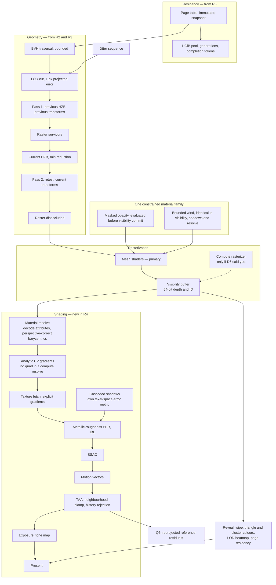

# R4 — Materials, temporal stability, qualification and release

**Weeks 156–205 · 807 team-hours · gates [B3-temporal, B4 and conditionally B4-M](r4-benchmarks.md) · post W5**

Parent documents: [Gates](../gates.md) · [Architecture](../architecture.md) · [Roadmap](../roadmap.md) · [CI](../ci.md) · [Math](../math.typ) · [References](../references.md)

---

## 1. Entry state

From R3: two-pass occlusion with same-frame recovery, a software page table with completion-token lifetimes, the demo corpus streaming at 9.5:1, metadata paging, the 48:1 measurement, and simple lit shading that has been deliberately unimproved for three releases.

## 2. Objective

Make it look right, then prove it.

For roughly three and a half years the demo has been unlit or flat-lit. That ordering was correct — geometric error has to be measured with TAA off, and material resolve depends on a stable visibility buffer — but it means R4 carries every visual decision at once, against a hard qualification bar, at the end of the plan.

**Temporal antialiasing is required, not optional.** At a 1-pixel error target, LOD transitions happen constantly and at sub-pixel scale. The reference design assumes the switch is hidden by a temporal filter, and Q6 becomes a numerical gate here for the first time.

## 3. Pipeline at the end of R4

## 4. Deliverables by module

| Module | Owner | Must do | Done when |
| --- | --- | --- | --- |
| `renderer/resolve` | A | Read visible identity, decode triangle attributes, reconstruct perspective-correct barycentrics, shade only visible surfaces. Fullscreen first; tile and bin compaction only once divergence is demonstrated | Shading matches a forward reference within tolerance ([math §10](../math.typ)) |
| `renderer/gradients` | A | **Analytic UV gradients** from the projected triangle, passed to an explicit-gradient sample | Neighbouring pixels may belong to unrelated triangles, so implicit derivatives are silently wrong here. Mip selection matches a forward path on slanted textured surfaces |
| `renderer/pbr` | A | Metallic-roughness, IBL, one directional light, exposure, tone mapping | Unlit textured MAE ≤ 2/255 outside the declared edge band |
| `renderer/shadows` | A | Four cascades, filtering, and the texel-space error metric from R3 | No light leaks; cascade transitions invisible in motion |
| `renderer/ssao` | A | Screen-space ambient occlusion | Stable under TAA |
| `renderer/motion` | A | Motion vectors, including previous deformation state for the foliage family | Ghosting bounded on the deformation sweep |
| `renderer/taa` | A | Jitter sequence, neighbourhood clamping, history rejection, disocclusion handling | **Q6's threshold is calibrated here against a known-good capture and frozen** |
| `renderer/textures` | B | Bounded texture sets, ordinary mip streaming, tracked separately from geometry | Texture residency is measured as its own budget. Geometry virtualization does not solve it |
| `materials/foliage` | B | One constrained family: opacity evaluated **before** committing visibility and depth; identical deformation in visibility, shadows and resolve; bounds expanded by the declared displacement envelope; normal-cone culling disabled | Zero hidden opacity holes promoted to opaque occlusion; zero bounds-culling losses at permitted deformation |
| `tools/inspect` | A | The reveal wipe, all modes toggleable while moving | The wipe reads as continuous motion, with no hitch above the frame budget |
| `game/` | B | Content freeze, clean-machine install, asset notices, reproducible build and run instructions | Three clean launches with no development-environment assumptions |
| `bench/` | B | Full T3 protocol, soak runs, percentile and determinism reporting | Another person can run it from the written instructions |

## 5. Contracts frozen this release

| Contract | Content |
| --- | --- |
| Q6 threshold | Calibrated against a known-good capture and frozen. Reprojected reference residuals with bias and RMS, not a raw frame difference |
| Content freeze | The hashed Zorah demo-corpus subset as it stands at the start of R4 |
| Deformation envelope | Declared per material; out-of-envelope deformation is rejected or its bounds expanded **before** rendering |
| Release archive | Source revision, asset manifest, machine manifests, raw samples, installation instructions |

## 6. Metal at the end of R4

Metal catches up fully: R3's streaming and occlusion **and** R4's materials, shadows and TAA, against a 196-hour allocation. This is the highest-risk porting concentration in the plan.

The monthly parity slices started in R3 are what keep it survivable. Each names the subsystem being brought level. If two consecutive boundaries pass with Metal more than one release behind, D2-d has become D2-b by drift and it should be made a decision instead.

Profile A is gated on **everything** at R4.

## 7. Qualification

| Gate | L | A |
| --- | --- | --- |
| Frame interval p95 / p99 | ≤ 16.667 / 22 ms | ≤ 33.333 / 45 ms |
| GPU p95 | ≤ 14 ms | from B0's **per-workload** ratios |
| CPU active p95 | ≤ 5 ms | as above |
| Engine-cold to controllable first frame | ≤ 15 s | ≤ 15 s |
| Reveal-only GPU overhead p95 | ≤ 1 ms | ≤ 2 ms |
| Input to updated frame p95 | ≤ 50 ms | ≤ 80 ms |

**L120 is measured and reported with no budget table and no pass or fail.** There is no 240 Hz tier.

## 8. The reveal, and its acceptance

Eleven pages of technical gates do not say whether the thing the project exists to produce is any good. Four criteria that are observable:

- A first-time viewer, given no explanation, can say what the reveal is showing.
- The wipe reads as continuous motion, not a mode switch: no hitch above the frame budget during the transition.
- At least one camera position where the selected detail is demonstrably produced by the hierarchy rather than by authoring — no authored LOD chain for that asset, selected-triangle count visibly changing as the camera approaches, page replacement observable, normal maps off.
- The page-residency view visibly changes as the player moves. If it looks static, the streaming test is not testing streaming.

## 9. Conditional: the compute rasterizer

Built only if the R2 histogram showed a material fraction of rasterisation work below ~1 px². If it was not, the finding is published in W5 and nothing here is built.

If it is built: shared 64-bit atomic target first, separate attachments plus merge only if a device refuses, with the merge cost measured when used (D6b). Identical clipping convention, sample position, top-left coverage rule, depth mapping and primitive identity on both paths ([math §4, §10](../math.typ)).

## 10. Exit

[B3-temporal and B4](r4-benchmarks.md) green on both profiles. A build that installs and runs on each qualification machine with no development tools. **Post W5**, including the compute-rasterizer measurement whichever way it went.

## 11. Risks specific to R4

| Risk | Signal | Response |
| --- | --- | --- |
| Every visual decision lands at once against a hard bar | R4 slips and the slip is unrecoverable | The descope ladder, in order: scene polish, then the compute rasterizer if it survived, then L120 reporting, then the foliage family |
| Metal catch-up overruns | Parity slices slipping through R3 and R4 | A slipped slice is a schedule event checked at the boundary, not absorbed |
| TAA hides a geometric defect | Q6 passes while still frames show error | Geometric gates run with jitter and TAA **off**. Q6 runs with them on. Both, always |
| Foliage defeats the geometric savings | Masked coverage and overdraw results | Constrain density and family. It is item 4 on the descope ladder for a reason |
| Texture residency becomes the second memory problem | Texture budget pressure at full PBR | Expected. It is tracked as its own budget from the start, and geometry virtualization was never going to solve it |
