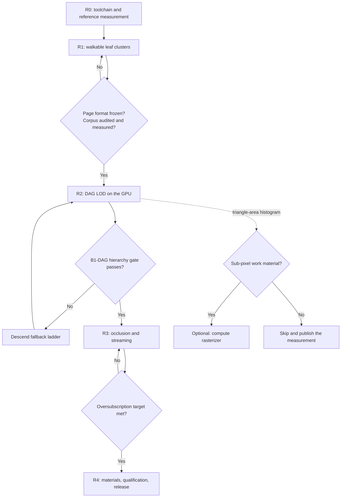
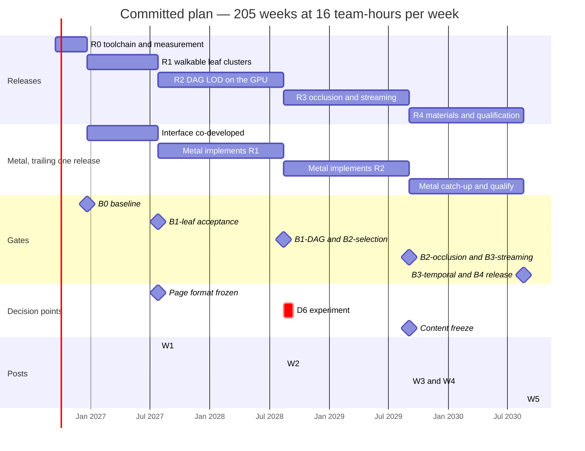

# Roadmap — two developers, two hours each per day

Companion files: [Architecture](architecture.md) · [Benchmarks](benchmarks.md) · [Gates](gates.md) · [CI](ci.md) · [Math](math.typ) · [References](references.md). Hardware, budgets and decisions D0–D8 live in the architecture file and are not restated here.

---

## 1. Capacity

Effort is quoted in **team-hours**. Calendar weeks are given at the realistic pace, where one week means 16 team-hours of work.

| | Optimistic | **Realistic** | Conservative |
| --- | --- | --- | --- |
| Days per week | 7 | 5 | 5 |
| Adherence | 100% | 80% | 65% |
| Hours per developer per week | 14 | **8** | 6.5 |
| Combined team hours per week | 28 | **16** | 13 |

Two things the realistic column accounts for that a nominal "2 hours a day" does not. Sustained part-time work over several years loses days to illness, travel and life; 80% adherence is optimistic, not pessimistic. And of each two-hour session, roughly 10 minutes go to loading context, 20 to verification and review, and 5 to a handoff note — so estimates made in engineering-hours and spent in session-hours differ by about a quarter. Contingency at 40% absorbs both.

### Totals

| Plan | Team-hours | @28 h/wk | **@16 h/wk** | @13 h/wk |
| --- | --- | --- | --- | --- |
| **Committed plan** | **3,276** | 117 weeks (2.3 y) | **205 weeks (3.9 y)** | 252 weeks (4.8 y) |
| **Committed plan + procedural generator** | **3,472** | 124 weeks (2.4 y) | **217 weeks (4.2 y)** | 267 weeks (5.1 y) |

The procedural generator is optional (D8). It is priced in both directions throughout this document so the choice can be made at any point, including mid-release, without re-planning.

### Derivation

| Line | Team-hours |
| --- | --- |
| Renderer, **Vulkan** backend, RHI, cooker integration, streaming, materials, tooling, evidence | 1,660 |
| R0 expansion: the toolchain and harness were under-budgeted | +60 |
| Metadata paging, required by the committed 48:1 corpus (D7) | +40 |
| Writing: 5 posts × 16 team-hours | 80 |
| Contingency at 40% | 736 |
| **Subtotal** | **2,576** |
| Metal backend, trailing one release (D2) | +500 |
| Its contingency at 40% | +200 |
| **Committed total** | **3,276** |
| *Procedural generator, optional (D8)* | *+140* |
| *Its contingency at 40%* | *+56* |
| **Total with generator** | **3,472** |

The first line covers Vulkan and the shared interfaces only; Metal is the separate +500 line and is not folded into it.

**On rounding.** Release rows are whole hours and whole weeks, so they sum to 3,275 against a derived 3,276, and to 3,471 against 3,472. That one hour is rounding, not an unassigned task, and no hours-to-weeks row is exact.

#### The unit, settled

**Base estimates are session hours, not focused implementation hours.** Verification, review and handoff are productive work and are already inside them.

This matters because the two readings are not close. The session model puts 85 of every 120 minutes on the bounded task, so converting focused hours to session hours costs `120/85 = 1.412` — **+41.2%**. If the base were focused hours, the 40% uplift would be consumed entirely by that conversion and the plan would carry **no allowance for unexpected engineering at all**.

Reading the base as session hours keeps the 40% available for risk, which is what a plan with a research milestone needs. It also means no estimate may be inflated again for verification or review time: that would charge the same activity twice.

**The weekly joint review is inside the base**, on the same principle — one combined person-hour per week, 205 hours over the plan, already counted in the session figure rather than added to it.

Three lines are load-bearing decisions rather than estimates. The DAG builder is integrated, not authored (D0) — authoring it adds roughly 250 hours. The Metal figure of 500 assumes D2 *and* D3 together, since Slang keeps the duplication host-side; without single-source shaders it moves toward 800. And the content figure assumes assembly from published corpora (D8), leaving import, sanitation, instancing layout and manifest discipline in the plan.

---

## 2. Working model

Developer A leads the renderer, Vulkan backend, culling, visibility and lighting. Developer B leads the cooker, asset pipeline, streaming, Metal backend, benchmark harness, CI and playable shell. Metal work is counted in B's budget, never treated as a free port at the end.

Each two-hour session: ~10 minutes of context, ~85 on one bounded task, ~20 on verification and review, ~5 on a durable handoff note. A weekly joint 30-minute review costs one combined person-hour.

Tasks small enough to finish in one to three sessions. Every task states an observable result, the affected backend or backends, and a reproduction command or scene. Integrate at least weekly.

**CI is not optional.** Two people on two operating systems cannot keep two backends and a shared geometry format in sync by discipline. The nightly golden-image job on both machines catches divergence within a day instead of at the next gate. Any shader layout change updates both backends and both test-vector sets in the same commit, and CI enforces it. See [ci.md](ci.md).

**Machine time is a shared resource.** Full benchmark runs occupy a laptop exclusively for hours, and that laptop is also someone's development machine. Hence the tiered protocol: CI overnight, gates by hand at release boundaries.

---

## 3. Release schedule

Five releases, each producing something runnable.

### Committed plan

| ID | Weeks | Team-hours | Deliverable | Gate | Post |
| --- | --- | --- | --- | --- | --- |
| **R0** | 1–14 | 224 | Toolchain, reference measurement, CI skeleton, backend bootstrap | B0 | — |
| **R1** | 15–45 | 488 | **Walkable scene rendering cooked leaf clusters.** No LOD, no streaming. Playable | B1-leaf | W1 |
| **R2** | 46–100 | 882 | **Cluster-DAG LOD**, CPU then GPU selection, runtime BVH, indirect, mesh shaders | B1-DAG, B2-selection | W2 |
| **R3** | 101–155 | 874 | **Two-pass occlusion, streaming at 9:1, metadata paging.** The 48:1 full-scene run is `conditional` and does not block | B2-occlusion, B3-streaming | W3, W4 |
| **R4** | 156–205 | 807 | **Materials, shadows, TAA, content freeze, qualification, release** | B3-temporal, B4 | W5 |
| **Total** | **205** | **3,276** | Playable demo, B0–B4, W1–W5 | | |

### With the optional procedural generator

| ID | Weeks | Team-hours | Generator work included |
| --- | --- | --- | --- |
| R0 | 1–14 | 224 | — |
| R1 | 15–48 | 544 | +56 — generator v1, first parameterized assets |
| R2 | 49–103 | 882 | — |
| R3 | 104–167 | 1,014 | +140 — a generated corpus alongside the Zorah one, with an exact oversubscription dial |
| R4 | 168–217 | 807 | — |
| **Total** | **217** | **3,472** | **+196** |

Release hours in both tables include the trailing Metal backend per D2: R1 +84, R2 +182, R3 +238, R4 +196, contingency included. Metal implements the previous release's feature set, so Profile A is a qualification profile from R2 onward, one release behind on features.

### Per-release working documents

Each release has an architecture sheet and a benchmark sheet in `milestones/`, written to be opened once at the start of that release and kept open through it. The architecture sheet carries a diagram of the pipeline **as it stands at the end of that release**, so the shape of the system is visible at each step rather than only at the end.

| Release | Architecture | Benchmarks |
| --- | --- | --- |
| R0 | [r0-architecture.md](milestones/r0-architecture.md) | [r0-benchmarks.md](milestones/r0-benchmarks.md) |
| R1 | [r1-architecture.md](milestones/r1-architecture.md) | [r1-benchmarks.md](milestones/r1-benchmarks.md) |
| R2 | [r2-architecture.md](milestones/r2-architecture.md) | [r2-benchmarks.md](milestones/r2-benchmarks.md) |
| R3 | [r3-architecture.md](milestones/r3-architecture.md) | [r3-benchmarks.md](milestones/r3-benchmarks.md) |
| R4 | [r4-architecture.md](milestones/r4-architecture.md) | [r4-benchmarks.md](milestones/r4-benchmarks.md) |

Each architecture sheet follows the same shape: entry state, objective, pipeline diagram, deliverables by module with an owner and a done-when, contracts frozen, the Metal position under D2-d, what is deliberately absent, exit condition, and the risks specific to that release. Each benchmark sheet gives the fixtures created there, the procedure, the blocking conditions separated from the recorded measurements, the evidence bundle, and what to do when each one fails.

The project-wide files remain the contract; these are the working views onto it.

### Why releases rather than internal gates

Each release is a tag, a build that runs on a clean machine, a benchmark bundle and a publish-ready post. Not a demo video — a build.

Three things this buys. **Motivation**: something runs and is shareable within the first year, then roughly annually, which matters more than any technical decision here for a multi-year evening project. **Feedback**: integration bugs surface while the system is still small enough to debug in two-hour sessions. **Article sequencing**: a post tied to a release describes something that has stopped moving, so the page format W1 documents is the page format that ships.

---

## 4. Work by release

### R0 — toolchain, measurement, harness (weeks 1–14, 224 h)

Decisions D0–D5, D7 and D8 are already taken, so this release measures and builds rather than deliberates.

**Both:** stand up the Slang toolchain (D3) — build integration, per-target capability profiles, shader hashing wired into the manifest, and one non-trivial kernel compiled and running on both SPIR-V and MSL. Pin the Slang, meshoptimizer and `clusterlod.h` versions. Do this first: every kernel written before the toolchain exists is a kernel written twice.

**A:** small rendering interface, Vulkan device and swapchain, reversed-Z reference path, frame markers. Microbenchmark on both devices — 64-bit buffer and fragment atomics, **the exact `ulong` atomic max in a compiled MSL kernel**, mesh-shader cluster dispatch throughput, `doubleSided` cost on the mesh path, and page decode throughput at 64/128/256 KiB.

**B:** CI skeleton with golden-image comparison running nightly on both machines ([ci.md §11](ci.md), steps 1–3, ≈50 h — the remaining bootstrap moves into the releases whose fixtures it serves). Benchmark harness v0. Content cache scaffolding for Linux-only cooking. Build and run `vk_lod_clusters` on Profile L with the threedscans scenes and record frame times, pool occupancy and streaming behaviour. Run `clusterlod.h` over a test mesh and record build time, node counts, reduction per level and RSS — the first exercise of the differential oracle R2 depends on.

**Exit B0:** reference measurements in the manifest; the Apple-to-Linux ratio derived rather than assumed; Slang building for both targets from a single source; CI green on both machines with a trivial fixture; dependency versions pinned and recorded.

R0 is 224 hours, not the 140 originally allowed. The CI bootstrap alone would have taken 57% of that figure, leaving too little for two API bootstraps, the Slang toolchain, cross-device microbenchmarks, reference runs and cooker experiments. This release produces almost no engine and is the highest-leverage fourteen weeks in the plan. Every performance target in the benchmark file is currently a guess, and B0 replaces several with numbers. It also front-loads the two dependencies the plan leans on, so a nasty surprise in either arrives in week 6 rather than week 60.

### R1 — walkable leaf clusters (weeks 15–45, 488 h)

The vertical slice. No LOD, no streaming, no occlusion culling. Cooked clusters, indexed indirect rasterization, a character walking around, and a reveal that colours clusters.

**A:** cluster decode on the GPU, cluster-ID inspection, image comparison against the ordinary indexed renderer, reversed-Z conventions locked in, basic unlit then simple lit shading.

**B:** importer and sanitation with **reindexing first**. Leaf partitioning via `meshopt_buildMeshlets`. Quantization. Page format v1 — **and freeze the page envelope here**, chosen from the R0 decode and I/O sweep. Before freezing, run one builder-generated multi-page group through the R1 format tests even though the R1 renderer ignores its hierarchy: otherwise R2 discovers that group records, closure references or alignment do not fit a format already shipped in W1. Freeze the envelope and the versioning policy, and reserve a named schema revision for R2's payload additions. Cooker cache keyed by input hash and settings. **Asset acquisition and audit**: download the public corpora, read and archive every licence in the manifest, record source hashes, and measure the actual unique-triangle count rather than assuming it. Collision proxies and character controller. Deterministic replay.

*With the generator (+56 h):* `tools/gen/` v1 — parameterized rock and debris at a fixed density, seeded, feeding the same import path.

**Exit B1-leaf:** deterministic cooking, seam-coordinate equality, complete source coverage, bounded decode error, cook budgets met (≤ 2 minutes for 10 M triangles). Walkable with collision, jump and reset. Cluster-colour reveal reads actual cluster IDs.

**Post W1** ships with it, describing a format that is now frozen.

### R2 — LOD on the GPU (weeks 46–100, 882 h)

The largest release and the one holding the real research risk.

**B:** integrate `clusterlod.h` at the pinned version. Group-consistent error and projection bounds, dependency closures and page packing for groups are ours and are where the gate's risk actually sits. Keep a locked-boundary-tree diagnostic for the W2 comparison, and run the differential oracle against `clusterlod.h`'s own group output on every fixture — that diff is the first thing to check when the cut validator disagrees with reality.

**A:** CPU reference cut selector and monotonic **projected**-error validator; a validator that only checks scalar monotonicity will pass a broken hierarchy. LOD transition visualizer. Then the runtime BVH, distinct from the replacement DAG: GPU traversal and compaction, local error and frustum predicates, indirect arguments, bounded queues, material bins. Level-wise dispatch first; persistent queues only after forward-progress and termination tests pass. Mesh-shader raster path (D3b), with indexed indirect draw retained as oracle and fallback.

**Also at R2, ~1 week:** the D6 triangle-area histogram. Instrument the raster path to measure projected triangle area at the 1.0 px target on real content, weighted by covered pixels and depth complexity. This measurement decides whether a compute rasterizer gets built at all. Do it before committing the weeks, not after.

**Exit B1-DAG and B2-selection:** legal cuts cover geometry exactly once; boundary fixtures have no internal holes; silhouettes inside tolerance; representative meshes actually simplify; GPU output agrees with the CPU reference on deterministic fixtures; high instance counts avoid one draw per cluster; bounded-buffer tests produce safe fallback.

**Post W2.** If the hierarchy gate fails, descend the fallback ladder rather than extending indefinitely, and move the dates explicitly.

### R3 — occlusion, streaming and the 48:1 measurement (weeks 101–155, 874 h)

**A:** reversed-Z HZB with minimum reduction, conservative projected bounds, two-pass occlusion with previous transforms for rejection and current transforms for recovery, same-frame disocclusion. GPU page lookup and feedback, generation checks, fallback cut selection, immutable per-frame page-table snapshots, camera and shadow request classes.

**B:** asynchronous reads and decompression, split-group activation with dependency closure, slot publication and eviction, bounded staging, memory-pressure handling, corrupted-page tests. Define, hash and cook the **Zorah demo corpus** (≈ 320 M triangles, 9.5 GiB, 9:1): a committed list of mesh identifiers and instance transforms shaped to carry the demo route, plus instancing layout and a frozen manifest. Then **metadata paging** — at the full scene's 25.5 M clusters the records alone are 1.52 GiB against a 1 GiB pool, so the top twelve levels pin at ≈ 8.4 MB and everything below pages with its geometry, with resident parents stopping safely at paged-out children. Then cook and run the **full 1.63 G scene** (48.6 GiB, 48:1) as the headline measurement, at ≤ 8 threads and ≤ 90 minutes, checking free disk first: it needs about 60 GiB.

*With the generator (+140 h):* scale `tools/gen/` to produce the full corpus, with a dataset-size parameter that hits any oversubscription ratio exactly. This replaces corpus assembly as the primary content path; the borrowed corpora remain as stress and reference.

**Exit B2-occlusion and B3-streaming:** no false-occlusion holes; measured reduction of hidden work; tolerable open-scene overhead; the demo corpus streams at ≥ 9:1 with bounded physical allocations; missing detail degrades gracefully; teleports recover without holes or GPU lifetime errors. **Replay must actually request new geometry** — a loop inside a warmed working set proves nothing. The 48:1 full-scene run is reported with its achieved decoded ratio, or marked unavailable if metadata paging or disk did not come through; it does not block the release.

**Posts W3 and W4.**

### R4 — make it look right, then qualify it (weeks 156–205, 807 h)

**A:** PBR material resolve with analytic texture gradients, IBL, cascaded shadows with their own light-space error metric, SSAO, motion vectors, TAA. Profile critical paths, tighten pass budgets, run the L60/A30 qualification and report L120 as a measurement.

**B:** texture and mip handling, the one bounded foliage material, previous-state deformation checks, content freeze, reveal polish, clean-machine installation, asset notices, reproducible build and run instructions, soak tests, release archive.

**Exit B3-temporal and B4:** image, coverage and temporal-stability gates pass; required L60/A30 performance, memory and scaling gates pass; both builds launch without development tools; the long soak shows no material leak; published results carry exact environment and asset hashes; the qualitative reveal criteria are met, including a first-time viewer being able to say what the reveal is showing.

**Post W5**, including the compute-rasterizer measurement and whatever it concluded.

---

## 4b. Checkpoints inside the long releases

R2 spans roughly a year. Waiting until its end to learn whether the group representation works is the single most expensive way to find out. Every six to eight weeks inside R1–R4, produce three things:

| Artifact | Test |
| --- | --- |
| One new fixture, added to the nightly tier | It regresses from then on, rather than only at the gate |
| A passing correctness bundle | The evidence format works before it is needed under pressure |
| A build that runs on the other developer's machine | Integration debt is paid in weeks, not in quarters |

Order inside R2 specifically, with a dated checkpoint rather than an intention:

**Week 20 of R2 (week 65 overall) is a hard checkpoint.** The CPU cut validator must run correctly over S0 and S2 adversarial fixtures **before** the GPU runtime BVH, traversal or compaction kernels are written. R2 spans 55 weeks; waiting for B1-DAG at its end means topological bugs surface forty weeks after the code that caused them, and the debugging budget is two hours a day.

If the checkpoint is missed, that is a schedule event at week 65 with 35 weeks of R2 remaining to absorb it — which is precisely the point of placing it there. Then add GPU traversal, then scale. A wrong group representation found at week 65 costs weeks; found at week 100 it costs the release.

**Metal parity slices.** D2 has Metal trailing one release, which concentrates the largest catch-up in R4 — where it must absorb R3's streaming and occlusion *and* R4's materials, shadows and TAA against a 196-hour allocation. That is the highest-risk porting concentration in the plan. Define a monthly parity slice through R3 and R4, each naming the subsystem being brought level, and check it at every release boundary. Slipping one slice is a schedule event, not a rounding error.

**Per-release effort split, required before the dates are committed.** Equal team capacity is not interchangeable capacity. B carries the cooker, assets, streaming, Metal, the harness, CI and the playable shell; the monthly parity slices do not by themselves establish that this fits eight hours a week.

Produce one table per release with A hours, B hours, shared review and the dependencies between them. Three places need it most:

| Where | Why |
| --- | --- |
| R3 | B's streaming work overlaps the trailing Metal implementation of R2's features |
| R4 | Metal catches up two feature generations against 196 hours, while B also runs content freeze and release engineering |
| R1–R2 | The bounded CPU oracle and any metadata paging pulled earlier than S9 are new work not in the original split |

Price the conditional compute-rasterizer branch separately; it is fifteen weeks and cannot come from contingency.

**The concrete mitigation, not just a table.** Ownership is currently drawn along a subsystem boundary — B owns Metal entirely — and that boundary is what concentrates the risk. Draw it along a **layer** boundary instead for the passes A authored:

| Work | Owner | Why |
| --- | --- | --- |
| Metal RHI bridge and command encoding for the occlusion passes | **A**, in R3 | A wrote the Vulkan pass and holds the synchronization model. Handing the encoding to B means B reverse-engineers a design A already has in their head |
| Metal encoding for PBR, shadow and TAA passes | **A**, in R4 | Same, and R4 is where B is already absorbing two feature generations against 196 hours |
| Metal device, resources, memory, page publication, submission | B | The parts that pair with B's own streaming and cooker work |

This does not reduce total hours. It moves the part of the Metal catch-up that is cheapest for A and most expensive for B, which is the only lever available without changing scope.

**Treat 205 weeks as a capacity scenario refreshed at each release exit, not a date.** For a plan this long the small runnable checkpoints are the meaningful commitments.

---

## 5. Decision calendar

Closed: D0, D1, D2, D3, D3b, D4, D5, D7, D8. Reopening any of them is a scope change that updates all four documents, not a quiet adjustment.

| Open | Deadline | Default if not made |
| --- | --- | --- |
| Page size and format freeze | End of R1, **after** one builder-generated multi-page group has passed the R1 format tests | 128 KiB, with a named R2 schema revision reserved in advance |
| Unique-triangle target — does the demo subset reach ≈ 320 M? | End of R1, measured | Reduce the target and report the real number. Never pad the corpus to preserve a ratio |
| D6 — build the compute rasterizer? | At the R2 histogram, and nowhere else | No; publish the measurement |
| D6b — shared atomic target or separate-attachment merge? | Only if D6 says yes | Shared atomic target |
| Metal catch-up checkpoint — still one release behind? | Every release boundary | Schedule event; use the descope ladder |
| Content freeze | Start of R4 | The hashed Zorah demo-corpus subset as it stands at that date |
| Write the procedural generator? | Any time, or never | No — optional work outside the committed plan |

---

## 6. Descope ladder and kill criteria

**Descope in this order, and only in this order:**

1. Extra scene areas and art polish.
2. The compute rasterizer, if the R2 histogram did not already remove it.
3. L120 reporting.
4. The bounded foliage material — the hardest material family for a cluster renderer.
5. **The S9 full-scene measurement**, taking metadata paging above the 32 MiB pinned cap with it, and leaving the demo corpus at 9:1. It drops a 90-minute cook and roughly 120 GiB of disk and costs only the headline number. It is `conditional` already, so this step formalises a state the registry allows; and it sits above the Metal backend because dropping an optional measurement before a promised platform is the coherent order.
6. The native Metal backend, moving the Mac to a follow-on program. The largest single lever, worth ~700 hours including contingency. It reopens a closed decision, so it is recorded as a scope change and all five documents are updated.
7. Error target from 1 px to 2 px, with the change named in every published result. This permits **coarser** cuts and reduces workload; it cannot repair invalid coverage, and the legal-cut gate is unaffected.
8. Instanced-triangle scale target, reported honestly as reduced.

Note that step 5 does **not** drop metadata paging outright: 305 MiB of demo-corpus records still exceeds the 512 and 256 MiB profiles, so paging survives for those unless the stress profiles are dropped with it.

**Never descope:** valid geometry coverage with no holes, bounded residency, the reveal reading actual selected geometry, benchmark integrity, a playable route.

**Kill criteria** — if any is true, stop and re-plan rather than continuing:

- No walkable build by week 57 (R1 twelve weeks late).
- The hierarchy gate has failed at the bottom of the fallback ladder.
- Either developer's logged hours below 50% of plan for two consecutive months. That is a capacity problem, and the answer is a smaller plan rather than more determination.
- Metal more than one full release behind at two consecutive release boundaries. At that point the trailing model has become deferral by drift, and it should be made a decision instead.

Review remaining hours at every release boundary. If a research blocker persists across two weekly reviews, write a short decision record: the failed fixture, the competing approaches, the next experiment, the schedule impact.

---

## 7. Optional and follow-on work

| ID | Scope | Team-hours | Weeks @16 h | Gate |
| --- | --- | --- | --- | --- |
| **G** | **Procedural content generator.** Optional at any point, including mid-release. Parameterized rock, ruin and debris at arbitrary density, seeded and deterministic; a dataset-size dial that hits any oversubscription ratio exactly | 140 (+56 contingency) | 9–12 | No gate. If built, it must reproduce the frozen corpus statistics or the content freeze is re-run |
| P1 | Broader programmable raster materials, two-sided and masked foliage, bounded deformation, material switching | 600–1,000 | 38–63 | BP1 |
| P2 | Multi-view selection for better shadows, moving rigid collections, broader renderer integration | 400–800 | 25–50 | BP2 |
| P3 | Production asset resilience, ≥ 32 GiB scenes, content workflows, expanded device qualification | 600–1,400 | 38–88 | BP3 |

G is the only item that can be picked up during R1–R4. P1 and P2 follow R4 and can be reordered; their results feed P3. Completing them does not certify Nanite equivalence — for every parity claim, name the exact reference version and behaviour, and compare observable outputs and workloads rather than implementation labels.

---

## 8. Timeline

Committed plan, realistic pace, starting mid-September 2026. Metal bars show the trailing implementation: each one covers the *previous* release's feature set.

Taking the optional generator adds 196 hours, which is 12.25 weeks of capacity: the finish moves from week 205 to week 217, R1 out by three weeks and R3 by nine.

The D6 experiment runs in the **last four weeks of R2**, matching the milestone sheet: it measures projected triangle area on selected geometry through the mesh-shader path, and neither exists until then. If the branch is taken, its fifteen weeks need a priced calendar alternative or a named scope substitution.

---

## 9. Traceability

At every accepted release, retain the source revision, cooker, asset, generator-seed and config hashes, environment manifest, raw results, summary, correctness captures and known limitations. This is what turns a long part-time effort into a sequence of recoverable, reviewable working states rather than one long uncommitted attempt.

Every release maps to a benchmark gate in the companion file. The five posts add editorial gates E-W1–E-W5, not implementation milestones.
